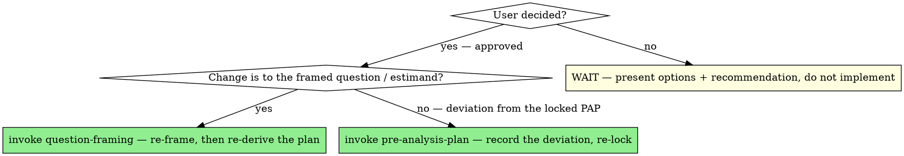

# Analysis Checkpoints

## Overview

Autonomy is the point of a good analysis loop — and also its biggest hazard. You can iterate fast toward a goal, but the same momentum that makes you productive makes you redefine the goal mid-flight without noticing: a debugging session quietly becomes a redesign, an outlier "obviously" gets dropped, a near-vs-far DiD silently becomes a triple-difference. Each step felt like progress. Collectively, the user got an analysis they never agreed to.

**Core principle:** Loop autonomously *toward the agreed goal*. Never redefine the goal — the design, the sample, the spec, the estimand, the metric — behind the user's back. When execution wants to change any of those, that is a **checkpoint**, not a task: stop, surface it, and let the user decide.

This is the execution-time form of "Think Before Coding": don't decide silently, surface the tradeoff. The up-front skills (`question-framing`, `pre-analysis-plan`) establish the agreed goal; this skill protects it while the work runs.

## The line: your call vs. the user's call

The test is simple — **does this change what is being estimated, on what data, or a number the user has already seen?** If yes, it's the user's call. Run this one question on *every* decision you're about to make; the two lists below are just worked examples of "yes" (STOP) and "no" (proceed and report).

### Decisions that REQUIRE a checkpoint — STOP and ask
- **Design / identification strategy.** Switching estimators or designs (near-vs-far DiD → triple-difference, OLS → IV, adding/removing a fixed effect that changes identification, changing the comparison group). This is the most commonly smuggled-in change.
- **The structural model itself.** For structural work: the utility/payoff form, the random-coefficient distribution, the conduct/equilibrium assumption, what's treated as a primitive vs. held fixed or calibrated, and the counterfactual design. These decide what is even being estimated and what the counterfactual means; they belong in the approved model card, so changing one mid-estimation — switching Nash–Bertrand to collusion, adding a random coefficient to make estimates behave — is a deviation, not a fix (`structural-estimation`).
- **Any deviation from the framed question or the pre-analysis plan.** The PAP exists precisely so these stops happen. A deviation is allowed — but disclosed and approved, never hidden.
- **The estimand.** ATE vs. ATT vs. LATE, the population, the time window.
- **The sample.** Dropping rows, filtering, winsorizing, trimming, excluding outliers, changing inclusion/exclusion rules, restricting to a subsample.
- **Materially different specifications or models** where there's a real tradeoff (functional form, control set, clustering level, missing-data handling, imputation).
- **Metric definition / units / grain.** Redefining the numerator or denominator, changing the unit of observation.
- **The scope of the robustness suite.** Don't fan out an exhaustive menu of checks. Propose the ~3 that probe the main threat, with rationales, and get approval before running — robustness is an argument, not an inventory (`executing-analysis-plans`).
- **Any number the user has already seen** that your change would move.

### Decisions you may make autonomously — note it, don't ask
- **Mechanical data-bug fixes that *restore* the intended computation** — dedup a key that was always meant to be unique, correct a wrong join type, fix a units error, repair a broken date parse. These return the analysis to what was already agreed; they don't change the design. Always **report** what you fixed. **Tiebreaker:** a restoring fix that nonetheless *moves a number the user has already seen* is still a checkpoint — apply it, but surface the moved number (old → new, and why) before building anything further on it.
- **Code-craft choices** — variable names, how a transform is written, plot styling. (See `analysis-craft`.)

The dividing question between a fix and a redesign: *"Am I restoring the analysis we agreed on, or changing it?"* Restoring → proceed and report. Changing → checkpoint.

## How to run a checkpoint

When you hit one, stop and present — don't implement past it:

1. **Name the decision** plainly: "This is a change to the identification strategy."
2. **Show the evidence** that surfaced it: the diagnostic, the number, the failed check.
3. **Lay out the options** — at least two — each with its tradeoff and what it would change about the result.
4. **Give your recommendation and why** — you're not abdicating judgment, you're surfacing it for approval.
5. **WAIT.** Do not write the redesign, drop the rows, or re-estimate until the user chooses. Implementing "so it's ready for them to see" is the exact failure mode.

**If you cannot reach the user** (a batch, cron, or otherwise non-interactive run), a deadlock is wrong but so is deciding for them: **stop at the last validated state, do NOT implement the checkpoint-class change, and return the options + your recommendation as the deliverable** for a human to resolve. Surfacing the decision unresolved is the correct output, not a failure.

**Worked example (the kind that should always stop):**
> While debugging the high near-clinic effect I found the 2016 citywide recording jump is geographically uneven — Beverly's 2 mi ring is +66% in 2016 while its 0.5 mi ring is flat. A plain near-vs-far DiD would misread this as an acquisition effect.
> **Options:** (a) upgrade Design B to a triple-difference (add band×month FE to absorb the citywide near-vs-far differential) — most robust, but changes the pre-registered design; (b) keep Design B and add the differential as a documented caveat; (c) restrict to cities without the uneven jump.
> **My recommendation:** (a), because it directly removes the confound — but it's a deviation from the PAP, so it's your call.

That stops *before* the band×month FE is written. The earlier behavior — writing the triple-difference and presenting it as "the fix" — is what this skill exists to prevent.

## "Loop until verified" ≠ "loop until you like the number"

Goal-driven autonomy (from `analysis-craft` / the gateway) means: iterate freely toward **fixed, agreed success criteria**, and don't stop at "the code ran." It does **not** authorize changing the criteria, the design, or the sample to reach a result. If hitting the goal seems to require changing the goal, that's the loudest possible checkpoint — stop and say so.

## Red flags — STOP

- You're mid-debugging and about to "upgrade", "switch to", or "fix" the design/spec to make a number behave.
- You're about to drop, trim, or winsorize data the user didn't ask you to drop.
- A change you're making would move a number the user has already seen, and you weren't going to mention it until the end.
- You've started writing the redesigned model *before* the user agreed to redesign.
- You're treating a deviation from the PAP as an implementation detail.
- You catch yourself thinking "they'll obviously want this" — that's the rationalization that precedes deciding for them.

## Common rationalizations

| Excuse | Reality |
|---|---|
| "It's clearly the right fix, I'll just do it." | If it changes the design or sample, "right" is the user's judgment to make. Surfacing it costs a paragraph; the wrong silent change costs their trust in every number. |
| "I'm just fixing a bug." | Restoring the agreed computation is a fix. Changing what's estimated is a redesign wearing a bug's clothes. Ask which one it is. |
| "I'll show them the redesigned version, that's clearer." | Then they're reviewing a fait accompli, not deciding. Present the options before you build one. |
| "Stopping breaks my flow." | Your flow is not the goal. An analysis the user didn't authorize is rework at best and a wrong decision at worst. |
| "Looping until verified means I keep going." | Toward the agreed goal — yes. By changing the goal — no. That's the line. |

## When to Use → where this hands off

A checkpoint is a STOP-and-ask gate, **not** a place to keep working. It is the gate the whole discipline routes INTO — so its job is to return the decision to the user, then *propel* into exactly one skill to absorb that decision before you resume what you interrupted:



## The Process

1. **Run the checkpoint** — name the decision, show the evidence, lay out ≥2 options, give your recommendation, and **WAIT.** Do not implement past this point.
2. **If non-interactive** — stop at the last validated state and return the options + recommendation as the deliverable; do not decide for the user.
3. **Once the user decides**, absorb the change before resuming — route to exactly one next step and *invoke that skill*:
   - **Estimand / question changed → invoke `question-framing`** to re-frame, then re-derive the brief.
   - **Deviation from the locked plan → invoke `pre-analysis-plan`** to record the deviation and re-lock before any further estimation.
4. **Then return to the skill you interrupted** (`wrong-number-debugging`, `executing-analysis-plans`, `structural-estimation`) and continue from the now-approved state — never resume on the silent change.## The bottom line

```
Executing well  →  loop autonomously toward the agreed goal; stop and ask before changing the design, sample, spec, estimand, or any number already seen
Otherwise        →  an analysis the user never agreed to, assembled one reasonable-looking step at a time
```
