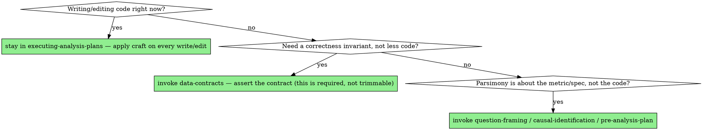

# Analysis Craft

## Overview

The rigor skills in this family keep you from being **wrong**. This skill keeps the analysis **legible, reproducible, and cheap to change**. They are different axes: a result can be perfectly validated and still buried in an over-engineered pipeline nobody can read, or a tidy script can be surgically edited and still compute the wrong thing. You want both — correct *and* well-crafted.

**Core principle:** the minimum analysis that answers the question, edited with the smallest diff that does the job. Restraint, not cleverness.

These principles are adapted from Andrej Karpathy's observations on how LLMs over-assume, overcomplicate, and over-edit — translated to data work.

## Simplicity First — the minimum analysis that answers the question

Analysis code has a strong pull toward over-engineering, because the tools make abstraction cheap and "what if we need it later" always sounds prudent. Resist it. The script that answers the question in 30 readable lines beats the configurable framework that answers it in 300.

- **No speculative pipeline.** Build the analysis the question needs, not the data platform you imagine it becoming. A one-off comparison is not an ETL system.
- **No premature abstraction.** Don't write a function with five parameters for code that runs once. Don't build a class hierarchy for three transforms. Inline beats a single-use helper.
- **No unrequested configurability.** No config flags, no "mode" switches, no plug-in points nobody asked for. Hard-code the thing; generalize only when a second real caller appears.
- **Reach for the idiom, not the framework.** Where three `dplyr` verbs, a `pandas` group-by, or a `DataFrames.jl` combine does the job, don't pull in a heavyweight package or build a custom engine.
- **Don't handle impossible cases.** Guard the inputs that can actually occur; don't write error handling for states the data can't reach. (This is distinct from `data-contracts`, which asserts the invariants that *must* hold — that's required; speculative defensive code for impossible inputs is not.)

Test: **"Would a senior analyst call this overcomplicated?"** If yes, cut it. If a 200-line notebook cell could be 50 lines, rewrite it.

*Note on the statistical side:* "simplicity" also has a modeling face — don't kitchen-sink controls, don't search specifications. That belongs to **`causal-identification`** (specification stability) and **`pre-analysis-plan`** (forking paths), not here. This skill is about the *code*.

## Surgical Changes — touch only what the task needs

A notebook or analysis script usually belongs to someone, encodes decisions you can't see, and is trusted because it currently produces known numbers. Rewriting it while you were asked to make a small change is how you silently break a result nobody knew depended on line 84.

- **Every changed line should trace to the request.** If you can't explain why a line is in the diff, it shouldn't be.
- **Don't refactor working code you were only asked to tweak.** Adding a column is not license to restructure the whole pipeline, rename variables, or "modernize" the syntax.
- **Match the existing style.** Follow the file's conventions (tidyverse vs. base R, the existing naming, the existing structure) even if you'd personally write it differently. Consistency beats your preference.
- **Clean up only your own mess.** Remove the imports/variables/intermediate frames that *your* change orphaned. Leave pre-existing dead code alone — **mention** it, don't delete it, unless asked.
- **Keep diffs reproducible.** Don't reorder cells, re-run-and-commit unrelated output, or reshuffle a pipeline so the diff is unreadable. A reviewer should be able to see exactly what you changed and why.

Test: **"Could the owner of this notebook review my diff in two minutes and agree every change is necessary?"** If not, the diff is too broad — revert the unrelated changes and propose them separately.

## Think Before Coding — at the approach level

`question-framing` handles assumptions about the *metric*. This is the same discipline for the *method and the code*:

- **Always work from a written plan — sketch the steps before you code.** For anything **non-trivial** — *non-trivial* = a new transform or model, anything with an estimand/spec/sample/model *decision* in it, or more than a single-file, single-function edit — write a short **numbered roadmap of the steps** first (the 3–6 things you'll do, the key choices, what "done" looks like), confirm it, **and wait for that confirmation before coding.** Agree once, then build the whole roadmap autonomously — don't re-ask per step. This holds **wherever you were dropped into the task**: "just estimate this / fix that / add this analysis" mid-stream is not a licence to dive in — back up, write the few-line roadmap, confirm, then code. **An approved study-level design or brief upstream does *not* waive this** — "build the map / the panel / the figure" is a multi-step *task*, and its build steps (which inputs, which joins, what the output file is, how it matches repo conventions) are their own small roadmap to agree on, distinct from the study design that was already signed off. A genuinely trivial edit (a rename, a column, a one-liner with no decision in it) you just do. Three lines of roadmap are cheaper to correct than code built on the wrong approach.
- **State your assumptions about the data and the approach** before you write the transform — the grain you're assuming, the join you're about to do, the model you're reaching for. Surface them so they can be corrected cheaply now rather than debugged later.
- **Present competing approaches instead of silently picking one.** If there are two reasonable ways to compute or model this with a real tradeoff (a fast approximate aggregation vs. an exact slow one; FE vs. random effects), name the tradeoff and let the user choose rather than quietly deciding.
- **Name confusion instead of coding through it.** If the request is ambiguous or the data doesn't look like you expected, stop and say so. Guessing and building on the guess is the expensive path.

## Red flags — STOP

- Adding a class, framework, or config system to a script that runs once.
- Refactoring or restyling code you were only asked to make a small change to.
- A diff that touches lines unrelated to the request ("while I was in there…").
- Writing error handling for inputs the data cannot produce.
- Deleting pre-existing dead code that wasn't part of your task.
- Silently picking between two materially different analytical approaches without surfacing the tradeoff.
- Diving into a non-trivial change — or starting at the step the user pointed you to mid-task — without writing a short plan first.
- Wrote the plan but started coding before the user responded — the plan needs *confirmation*, not just authorship.
- A 200-line cell doing what 50 readable lines would.

## Common rationalizations

| Excuse | Reality |
|---|---|
| "I'm making it flexible for the future." | The future caller usually never comes, and the flexibility you guessed at is usually wrong. Generalize when the second real caller appears. |
| "While I was in there, I cleaned it up." | You also changed numbers someone trusted, in a diff they now can't review. Stay surgical; propose the cleanup separately. |
| "A framework is more professional than a script." | For a one-off analysis, the readable script *is* the professional choice. Overcomplication isn't rigor. |
| "I rewrote it in my preferred style." | The owner has to maintain it in theirs. Match the file, not your taste. |
| "I picked the better method to save a round-trip." | If the tradeoff is real, the choice is the user's. Surfacing it costs one sentence; the wrong silent choice costs the analysis. |
| "More error handling is safer." | Handling impossible inputs is noise that hides the checks that matter. Assert the real invariants (`data-contracts`); skip the rest. |
| "It's faster to just start coding." | For anything past a quick fix, three lines of plan first is faster than rewriting code built on the wrong approach. Plan, confirm, then code. |

## When to Use → where this hands off

Analysis-craft is **not** a step on the spine — it is the discipline you run *alongside* every code write or edit. It does not terminate; it routes back into execution and out to the correctness siblings. Route imperatively, don't just note the relationship:



## The Process

1. **Apply craft inline as you execute** — minimum code that answers the question, smallest diff that does the job. This is not a phase; it runs on *every* write/edit → stay inside **`executing-analysis-plans`**, don't break out to a separate "cleanup" step.
2. **A required invariant is not over-engineering** — when you need to guarantee a join cardinality, grain, or row count, that's the contract → invoke **`data-contracts`**, don't trim it as "speculative."
3. **Send statistical parsimony to its owner** — metric definition → invoke **`question-framing`**; specification restraint and control discipline → invoke **`causal-identification`** / **`pre-analysis-plan`**. This skill governs the *code*, not the model.
4. **Reviewing for over-build/over-edit?** → invoke **`analysis-review`** for correctness, and use this skill as the "is it also over-built?" lens.
5. **If a "small tweak" starts mutating the design or a number the user has seen → STOP and invoke `analysis-checkpoints`.**

## The bottom line

```
Well-crafted analysis  →  minimum code that answers the question, smallest diff that does the job, tradeoffs surfaced, style matched
Otherwise              →  a correct number buried in code nobody can read or safely change
```
