# Analysis Review

## Overview

Code review asks "is this code correct?" Analysis review asks a harder question: "is this *conclusion* correct?" — and the two come apart completely. Analytics code can be clean, idiomatic, well-tested, and pass any software review while delivering a confidently wrong number, because the bugs that matter here don't live in the syntax. They live in a join that fanned out, a metric nobody defined, a feature that leaked the target, a specification that was fished. This skill is a review lens aimed at exactly those.

**Core principle:** Review the path from data to claim, not just the code. The question is never "does it run?" — it's "would I bet the decision on this number?"

**"Review it" re-fires this skill every time — including mid-session.** A design you reviewed last week, or earlier in this conversation, doesn't stay reviewed: a new cut, a re-run, or a fresh "does this look right?" is a new artifact to review from scratch. Don't answer from loaded context ("I already looked at this") — re-run the checklist against *this* result.

## Reviewing an analysis — the checklist

Work down from the conclusion to the data. Each item is a class of silent error that survives ordinary code review:

**The claim**
- Is the **metric/estimand defined** precisely enough that you could recompute it the same way? (If "active users" or "the effect" is undefined, stop here — see `question-framing`.)
- Does the **conclusion actually follow** from the number, or is it a causal claim resting on a descriptive estimate?

**The data path**
- **Joins:** is there a row-count check around every merge, and is the cardinality (1:1 / 1:m / m:m) what they intended? This is the highest-yield place to find a bug. Ask to see the counts before and after.
- **Filters & missingness:** did any filter or aggregation silently drop `NA`/`missing` rows and bias the result? How is missing data handled, and was that decided by rule or by eye?
- **Totals reconcile:** do the parts sum to a whole computed an independent way? If there's no reconciliation, the number is unverified by definition.
- **Units & grain:** right unit of observation, right units (dollars/cents, proportion/percent), no double-counting.

**Models & causal claims**
- **Leakage:** any feature that encodes the target, any train/test overlap, any future information in a predictor? Leakage is the most common reason a model metric is "too good."
- **Identification:** for any causal claim, is the design named and are its assumptions stated and tested? (Hand off to `causal-identification` — parallel trends, first-stage F, manipulation test, balance.)
- **Specification search:** were the reported specs chosen before or after seeing results? Are the robustness checks the complete set, or a flattering subset? (See `pre-analysis-plan`.)
- **Structural models:** is each parameter's identification stated — what variation or moment moves it? Was the estimator shown to recover known parameters (a Monte-Carlo recovery test), or is a converged optimizer being taken as proof of identification? Is any counterfactual computed by *re-solving equilibrium* rather than holding prices fixed? Is the conduct/distribution assumption flagged as load-bearing and untestable? (Hand off to `structural-estimation`.)

**Prediction models** (when the deliverable is a score / flag / ranking, not an effect — the `predictive-modeling` arm):
- **Leakage variants:** target leakage (a feature that encodes the outcome), temporal leakage (future data in a predictor), group leakage (test rows share a group with train rows), and preprocessing leakage (scaling/imputation fit on the full sample before the split).
- **Split doesn't mirror deployment:** random split when temporal or group-aware splitting is needed — the held-out error will be optimistic and the model will underperform in production.
- **Tuning on the test set:** hyperparameters or thresholds selected by looking at test performance; no truly held-out evaluation remains.
- **Feature importance / SHAP read as a causal effect:** variable importance ranks predictive contribution under the training distribution — it is not an effect and does not survive an intervention.
- **Proxy label treated as ground truth:** the label was itself predicted, imputed, or derived from a biased process; reported performance is relative to a noisy or biased target, not the underlying truth.
- **No baseline to beat:** a model with no comparison to a simple rule, the prior rate, or a last-observation-carry-forward benchmark cannot be judged useful.
- **"Anomalous" flag reported as "guilty":** an outlier or anomaly score is a deviation from the training distribution, not evidence of wrongdoing; conflating them is a claim the model cannot support.

**Reproducibility**
- Does it **reproduce from a clean state** with a fixed seed, or only inside the author's live session?
- Do the **numbers in the prose/figures match** what the code actually produces now?

## Run it as an independent agent

For a genuinely independent pass — especially before results ship, or in parallel
with the work itself — dispatch the **`analysis-reviewer`** agent that Causal
Powers ships. A reviewer with fresh context catches what the author (you)
rationalized; it returns concrete findings with severity rather than a
rubber stamp. Use it in addition to, not instead of, reviewing as you go.

## Review like an adversary, not a proofreader

The useful question isn't "can I follow this?" — it's "how would this be wrong, and what would I check to find out?" For each headline number, form the specific failure hypothesis (this total looks high → maybe the join fanned out) and ask for the evidence that rules it out (show me the row counts). A review that only confirms the code is readable has reviewed the wrong thing. If you can't see the intermediate checks, the right response is "show me the reconciliation," not "looks good."

## How to request a review (so it's worth something)

If you're the author, make the analysis reviewable:
- State the **question, metric definition, and decision** up front (the `question-framing` brief).
- Show the **invariant checks** you ran — the join row-counts, the reconciliation, the missingness counts — not just the final chart.
- Flag what's **confirmatory vs. exploratory**, and which robustness checks you ran.
- Point the reviewer at the **load-bearing assumption** and ask them to attack it specifically.

A review of a polished output with no visible checks can only catch typos. Hand over the checks.

## Receiving review feedback — verify, don't perform

When someone critiques your analysis, the failure mode is reflexive agreement: "good catch, fixing now" to a critique you haven't verified. That's as bad as reflexive defense. The discipline is to **check the claim against the data**:
- If they say "this join looks like it double-counts," go run the row-count check and see. Confirm it bites before you change anything.
- If the critique is technically wrong, show the evidence that it's wrong — politely, with the reconciliation, not with an opinion.
- A critique you can't yet evaluate gets investigated, not agreed to. Performative agreement ships the bug with a thank-you attached.

## Red flags — STOP

- A review that signed off on "clean, readable code" without ever seeing a single data-integrity check.
- A headline number with no reconciliation and no row-count checks around its joins, presented as final.
- A model metric that's suspiciously good and no one has looked for leakage.
- A causal claim whose identification assumptions were never stated.
- Robustness checks that are exactly the ones that agreed with the headline.
- Agreeing to a review comment (or rejecting it) without running the check that would settle it.

## Common rationalizations

| Excuse | Reality |
|---|---|
| "The code is clean, so the analysis is fine." | Clean code computes the wrong thing just as reliably as messy code. Review the data path. |
| "I trust the author, they're careful." | Careful people fan out joins too. The check costs a minute; trust isn't a row-count. |
| "It's just an internal review, ship it." | The internal number drives the decision. Internal is exactly when nobody else will catch it. |
| "They flagged it, so it must be wrong — fixing." | Maybe. Verify it against the data first; agreeing without checking can introduce a new bug. |
| "There's no time to ask for the intermediate checks." | Then there's no time to know whether the number is real. Reviewing only the output is reviewing nothing. |

## When to Use → where this hands off

Review is **not** terminal and it does **not** end at "looks good / here are my notes." It is the silent-failure sweep `result-verification` dispatches before shipping — every finding *propels* into a fixing skill. Route imperatively on what the review surfaced:

```dot
digraph analysis_review_next {
    "Review surfaced a wrong number / data-integrity failure?" [shape=diamond];
    "invoke wrong-number-debugging — bisect the pipeline to the bad step" [shape=box style=filled fillcolor=lightgreen];
    "Review surfaced a design issue? (identification gap / spec search / misspecification)" [shape=diamond];
    "invoke analysis-checkpoints — route the design decision to the user" [shape=box style=filled fillcolor=lightgreen];
    "Clean — return to result-verification to ship" [shape=box style=filled fillcolor=lightgreen];
    "Review surfaced a wrong number / data-integrity failure?" -> "invoke wrong-number-debugging — bisect the pipeline to the bad step" [label="yes"];
    "Review surfaced a wrong number / data-integrity failure?" -> "Review surfaced a design issue? (identification gap / spec search / misspecification)" [label="no"];
    "Review surfaced a design issue? (identification gap / spec search / misspecification)" -> "invoke analysis-checkpoints — route the design decision to the user" [label="yes"];
    "Review surfaced a design issue? (identification gap / spec search / misspecification)" -> "Clean — return to result-verification to ship" [label="no"];
}
```



## The Process

1. **Run the checklist against *this* artifact** — claim, data path, models/causal claims, reproducibility. Don't answer from loaded context.
2. **For each headline number, form the failure hypothesis and demand the evidence that rules it out** — row-counts, reconciliation, missingness, leakage check, identification statement.
3. **Route every finding to a fixing skill — never stop at "here are my notes":**
   - Wrong number / unreconciled total / fanned-out join → **STOP and invoke `wrong-number-debugging`** to bisect to the bad step.
   - Design issue — identification gap, fished spec, structural misspecification → **STOP and invoke `analysis-checkpoints`** to route the decision to the user (it in turn hands to `causal-identification`, `pre-analysis-plan`, or `structural-estimation`).
4. **Log each confirmed finding's failure class** — one line per finding to the project's `docs/LESSONS.md` (symptom, cause, the check that would have caught it; create the file if absent). A review that only fixes this artifact fixes one artifact; the logged pattern hardens every future one (`result-verification` → "Capture what bit you").
5. **If it's clean** — metric defined, joins checked, totals reconciled, leakage ruled out, identification stated, reproduces from a clean seed → **return to `result-verification`** to ship.

## The bottom line

```
Reviewed analysis  →  metric defined, joins checked, totals reconciled, leakage ruled out, identification stated, reproduces clean
Otherwise          →  you reviewed the spelling, not the answer
```
