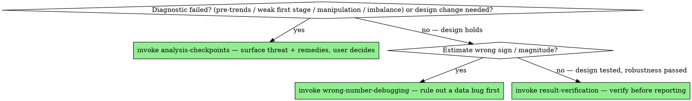

# Causal Identification

## Overview

A regression coefficient is a correlation with good posture. It becomes a causal effect only when a *design* rules out the other explanations — and that design rests on assumptions that no amount of clean data or tight standard errors can supply. The fatal causal error is silent: the code runs, the coefficient is significant, the sign is plausible, and it's still just confounding wearing the costume of an effect.

**Core principle:** State the identification assumptions before you estimate, and test the ones that are testable. The estimate is only as credible as the assumption you can't test — so make that assumption explicit and argue for it.

## First, what's your experiment?

Before any model, answer the Angrist–Pischke question: **if you could have run the ideal randomized experiment to answer this, what would it be — and what real-world variation are you using as a stand-in for that randomization?** Name the source of variation in one sentence and say why it's as good as random. If you can't, you don't have an identification strategy; you have a regression hoping to be one. Everything below — the design, the assumptions, the diagnostics — is just making that "as good as random" claim precise and testable.

## The Design Card — sign-off before estimation

Structural work locks a model card; prediction locks a Prediction Spec. A causal
claim locks a **Design Card** — write it into the plan file (root
`analysis-plan.md`, or the PAP when one exists) and get explicit sign-off
BEFORE estimating:

- **Causal question + estimand** — ATT/ATE/LATE, for which population.
- **Design + source of variation** — the "what's your experiment?" answer, one sentence.
- **The untestable assumption**, in plain language, and why it's plausible *here*.
- **Diagnostics planned** — the design-specific tests you'll run before reading the estimate.
- **Robustness shortlist** — the ~3 checks aimed at the main threat (running them is an `analysis-checkpoints` approval).
- **Primary spec** — outcome, treatment, FE/controls (each control with its confounding story), SEs/clustering.

Entering mid-stream ("just run the DiD") does not waive the card — reconstruct it
from context in ≤10 lines, confirm with the user, then estimate. "The user
already said regress Y on X" names the *spec*, not the *design*; the card is
still required.

## The discipline

```
NAME THE DESIGN  →  STATE THE ASSUMPTIONS  →  TEST THE TESTABLE ONES  →  ESTIMATE  →  ATTACK (robustness/placebo/sensitivity)  →  RECONCILE WITH DESCRIPTIVES
```

1. **Name the design and the source of variation.** Where does the comparison come from? What is treated vs. control, and *why* is the control a valid counterfactual? If you can't name the design, you don't have identification — you have a regression.
2. **State the assumptions out loud**, especially the untestable one. Every design has a load-bearing assumption you cannot verify from data (exclusion, parallel-trends-in-the-counterfactual, continuity, unconfoundedness). Name it and make the substantive argument for why it holds here.
3. **Test the testable implications** (the diagnostics below). **Borderline diagnostics are a checkpoint, not a green light** — a first-stage F of 8, a mildly sloped pre-trend, balance that *almost* resolves: surface these to the user, don't proceed past them silently.
4. **Estimate** with inference appropriate to the design (clustering, weak-IV-robust, etc.).
5. **Attack it** — propose the ~3 threat-relevant robustness/placebo/falsification checks to the user, get approval, then run them whether or not they're convenient (not the whole catalogue — see below).
6. **Reconcile** the causal estimate with the raw descriptive picture. An effect that's invisible in the raw data and only appears after heavy modeling deserves suspicion.

## Choosing or changing the design is the user's decision

Picking the identification strategy, and *changing* it once the analysis is underway, are among the most consequential calls in the whole study — they decide what is even being estimated. They are not yours to make silently. When a diagnostic fails (pre-trends violated, weak first stage, manipulation at the cutoff, imbalance that won't resolve) or you discover a threat that calls for a different design, present the **threat, the candidate remedies, and your recommendation** as a checkpoint and let the user decide — see **`analysis-checkpoints`**. Surfacing "the parallel-trends assumption is violated; we could switch to a triple-difference, restrict the sample, or report with a caveat" is the job. Quietly upgrading the design to make the estimate behave is not — especially when it deviates from the pre-analysis plan.

## Per-design assumptions and diagnostics

Tag discipline: items labeled **Test** are *diagnostics* — run them before or
with estimation, no approval needed. Items labeled **Robustness** (and every
placebo) belong to the approval-gated ~3-check shortlist (see "Robustness,
placebo, sensitivity"). Don't reclassify a placebo as a diagnostic to skip the
checkpoint, or a pre-trend test as robustness to stall it.

### Difference-in-differences / event study
- **Load-bearing assumption:** parallel trends — treated and control would have moved together absent treatment. Untestable directly; argue it.
- **Test:** pre-treatment trends (plot the event-study coefficients; flat, insignificant leads support but don't prove parallel trends). Check for **anticipation** (effects before treatment). Confirm **no compositional change** in the panel around treatment.
- **Staggered adoption is a trap:** with variation in treatment timing, two-way fixed effects (TWFE) is biased by "forbidden comparisons" of late-treated to already-treated units. Use a modern estimator: **Callaway–Sant'Anna, Sun–Abraham, Borusyak et al., de Chaisemartin–D'Haultfœuille, `did2s`** — not vanilla TWFE.
- **Inference:** cluster SEs at the unit that's treated (e.g., state), and worry about too-few clusters.

### Instrumental variables
- **Relevance (testable):** the instrument must move the treatment. Report the **first-stage F**; a weak instrument (rule of thumb F < 10, but prefer Olea–Pflueger) makes 2SLS badly biased and its SEs unreliable. Use **weak-instrument-robust inference** (Anderson–Rubin) when in doubt.
- **Exclusion (untestable):** the instrument affects the outcome *only* through the treatment. Cannot be tested — argue it substantively; the whole IV stands or falls here.
- **Monotonicity:** no "defiers." Needed to interpret the estimate as a **LATE** — and remember IV identifies LATE (effect on compliers), not ATE.

### Regression discontinuity
- **Continuity (load-bearing):** units just above and just below the cutoff are comparable; potential outcomes are continuous at the threshold.
- **No manipulation:** units can't precisely sort around the cutoff. Test with a **McCrary / density test** for a jump in the running variable at the threshold.
- **Robustness:** sensitivity to **bandwidth** (and use a principled one — `rdrobust`); **covariate smoothness** (no jumps in predetermined covariates at the cutoff); a **donut** specification excluding points right at the threshold; placebo cutoffs away from the real one.

### Matching / regression adjustment / propensity scores
- **Unconfoundedness (untestable):** selection into treatment is on observables only. The strongest assumption in the toolkit — argue it hard.
- **Overlap / common support (testable):** treated and control propensity distributions overlap. Trim or stop if they don't.
- **Balance (testable):** post-matching/weighting covariate balance — report **standardized mean differences** (rule of thumb |SMD| < 0.1), not just t-tests.

### Panel fixed effects
- Identify off **within-unit variation** — confirm there is enough of it; a near-time-invariant regressor is barely identified.
- FE controls only **time-invariant** confounders; time-varying confounders still bite.
- Cluster SEs at the appropriate level.

### Synthetic control
- **Load-bearing assumption:** no anticipation, and the treated unit's counterfactual lies in the convex hull of the donor pool (a donor pool of genuinely comparable, untreated units). Good pre-period fit is necessary but **does not guarantee** the post-period counterfactual.
- **Inference:** placebo/permutation across donor units (the RMSPE ratio), not a naïve p-value; report how extreme the treated unit's gap is in the placebo distribution.

### ML in service of a causal effect (double/debiased ML, causal forests, ML propensity)
When ML estimates the nuisances of a causal estimand, this arm still governs — the estimator changed, not the assumptions:
- **Cross-fitting is mandatory:** nuisance models (outcome, propensity) fit on folds disjoint from where their predictions enter the moment condition — a full-sample nuisance fit leaks the bias back in.
- **Overlap/positivity checked and reported** — ML propensities pushed to 0/1 are a design failure, not a modeling detail.
- **Orthogonalized moment, never a plug-in:** the estimate comes from the debiased/orthogonal score, not from reading a coefficient off the ML fit.
- **Nuisance diagnostics reported** (fit quality, propensity distribution), not just the final θ and its SE.
- **CATE heterogeneity is not a targeting license** — deploying scores from a causal forest needs the same unconfoundedness argument as the average effect, plus `predictive-modeling`'s deployment-matched evaluation.
- **The Design Card applies unchanged** — unconfoundedness/exclusion still carries the estimate; ML can't repair a design.

## Bad controls — the quiet killer of reduced-form work

Adding a control can *create* bias as easily as remove it. The rule: only condition on variables determined **before** treatment — and even that is necessary, not sufficient: a pre-treatment collider (M-bias) or a bias-amplifying near-instrument is still a bad control. Every control needs a confounding story, not just a timestamp. A control that is itself an outcome of the treatment reopens the very confounding you're trying to close.

- **Post-treatment controls / mediators.** Controlling for a channel the treatment works through (e.g. "effect of education on wages, controlling for occupation") nets out part of the effect and biases the estimate — usually toward zero, sometimes unpredictably. If it could plausibly have been *affected* by treatment, it is not a control.
- **Colliders.** Conditioning on a variable that both treatment and outcome cause induces a spurious association where none existed. Selecting the sample on such a variable does the same thing silently.
- **Selection on the outcome.** Filtering the sample on the dependent variable, or on anything downstream of it, manufactures correlation.

"I added more controls and it got more robust" is not reassurance — more controls can mean more bias. Each control needs a reason it's pre-determined, not just a wish to be thorough.

## Robustness, placebo, sensitivity — not optional

These are part of the estimate, not a courtesy — but **robustness is an argument, not an inventory.** "Mandatory" means the *threat-relevant* checks are not optional — **not** that you run the whole per-design catalogue. Run the few that would break the result if your identifying assumption fails, not every permutation you can think of: three checks that each probe the real threat beat thirty that probe nothing, and a senior reader treats a sprawling robustness table as a *tell* of weak identification. **Propose the shortlist (the ~3 threat-relevant checks, with rationales) to the user and get approval before running it** — this is a checkpoint, not an autonomous fan-out (`executing-analysis-plans`, `analysis-checkpoints`).
- **Placebo / falsification:** an effect on an outcome that shouldn't be affected, or in a period before treatment, signals that the design is picking up confounding.
- **Sensitivity to unobserved confounding:** how strong would an omitted confounder have to be to overturn the result? Use **Oster's δ** (coefficient movement vs. R² movement), **Rosenbaum bounds**, or **e-values**. A result that flips under a mild plausible confounder is not robust.
- **Specification stability:** the effect shouldn't hinge on one control or one functional form (run the pre-committed suite from `pre-analysis-plan`).

## Tooling (R / Julia / Python)

| Design | R | Python | Julia |
|---|---|---|---|
| FE / DiD (TWFE) | `fixest::feols` | `linearmodels.PanelOLS`, `pyfixest` | `FixedEffectModels.jl` |
| Staggered DiD | `did` (Callaway–Sant'Anna), `did2s`, `fixest::sunab` | `differences`, `pyfixest` | — (call R, or hand-roll CS) |
| IV | `fixest::feols(y ~ x | f | d ~ z)`, `ivreg` | `linearmodels.IV2SLS` | `FixedEffectModels.jl` (IV) |
| RDD | `rdrobust`, `rddensity` (McCrary) | `rdrobust` (py) | — (call R) |
| Matching / PS | `MatchIt`, `WeightIt`, `cobalt` (balance) | `causalinference`, `dowhy`, `econml` | — |
| Sensitivity | `sensemakr` (Oster/Cinelli), `rbounds` | `sensemakr` (py) | — |

When a stack lacks a mature implementation (much of staggered-DiD and RDD outside R), say so and either call out to R or implement the estimator explicitly rather than silently falling back to a biased TWFE.

## Red flags — STOP

- Reporting "the effect of X" from a regression with no named design and no stated counterfactual.
- A staggered-treatment DiD estimated with plain TWFE and no mention of the bias.
- An IV with no reported first-stage F, or treating LATE as if it were ATE.
- An RDD with no manipulation/density test and no bandwidth-sensitivity check.
- Matching that reports significance but never reports covariate balance or overlap.
- No placebo, no pre-trends, no sensitivity analysis — the estimate stands entirely on faith in the untestable assumption, unexamined.
- An "effect" that's nowhere in the raw descriptive data and appears only after the model.
- Controlling for variables that could have been affected by treatment (post-treatment controls / mediators / colliders) — or "it got more robust when I added controls" treated as reassurance.
- Switching or upgrading the identification strategy mid-analysis (e.g. DiD → triple-difference) without surfacing it to the user as their decision (`analysis-checkpoints`).

## Common rationalizations

| Excuse | Reality |
|---|---|
| "The coefficient is significant, so X causes Y." | Significance measures noise, not confounding. A precisely-estimated correlation is still a correlation. |
| "I added a bunch of controls, so it's causal now." | Controls handle the confounders you observed and named. The dangerous one is the one you didn't. |
| "Parallel trends obviously holds." | Then plotting the pre-trends costs you nothing and earns the reader's trust. If you won't plot it, you're not sure. |
| "TWFE is the standard DiD." | It was. With staggered timing it's biased toward the wrong comparisons. Use a modern estimator. |
| "The instrument is clearly exogenous." | Exclusion is untestable, which is exactly why it needs a real argument, not an assertion. |
| "Robustness checks are for the appendix." | They're for deciding whether you believe your own result. Run them before you commit to it. |
| "The user already said regress Y on X — that's my approval." | That approved the spec, not the design. The Design Card (variation source, untestable assumption, diagnostics) still gets written and signed off. |

## When to Use → where this hands off

Identification is **not** a terminal step. Once the design earns the estimate, it *propels* into exactly one next skill — route imperatively, don't just note the relationship:



## The Process

1. **Earn the estimate** — design named, untestable assumption argued, testable diagnostics passed, modern estimator used, threat-relevant robustness/placebo/sensitivity survived, reconciled with the raw data.
2. **If any diagnostic fails or the design needs to change → STOP and invoke `analysis-checkpoints`** — present the threat, candidate remedies, and your recommendation; the design call is the user's, never a silent upgrade.
3. **If the estimate has the wrong sign or magnitude → invoke `wrong-number-debugging` first** — rule out a data bug before blaming identification.
4. **Once the design holds and robustness passes → invoke `result-verification`** — run the placebo/sensitivity battery as part of verification before any number leaves the building. Do not end at "the coefficient is X".

## The bottom line

```
Causal claim  →  design named, assumptions stated, testable ones tested, modern estimator used, placebo + sensitivity survived, reconciled with raw data
Otherwise     →  a correlation with a confident voice
```
