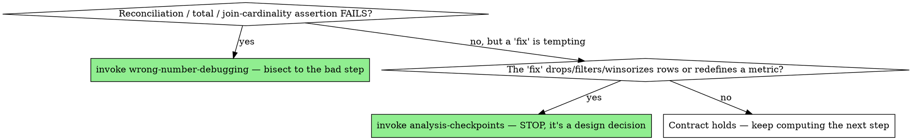

# Data Contracts

## Overview

A number you computed but never validated is a guess wearing a lab coat.

**Core principle:** Lock in what must be *true* before you trust what you *discovered*.

This is the **checker**. It asserts invariants and reconciles totals; it does not plan or run the work. Its complement is the **doer**: during the cleaning phase, `data-preparation` *calls* this skill to validate each ingest/join/dedup/recode step, and `executing-analysis-plans` calls it on every later spine step and fanned-out spec. You reach for `data-contracts` directly the moment you're about to trust a number or do a join — and the doers reach for it on your behalf throughout.

This is the data-analytics counterpart of test-driven development. TDD's literal ritual — "write a failing test asserting the exact output, then implement" — does not transfer to analysis, because in analysis the output is the unknown. You cannot assert `mean == 42.3` before you've computed it; computing it is the whole point. But the discipline underneath TDD transfers exactly, and matters *more* here.

## Why analysis breaks naive TDD (and why you still need its spirit)

In software the dangerous bug usually throws — a stack trace, a red test, something loud. In analysis the dangerous bug is **silent**: the code runs cleanly and hands you a confident, wrong answer.

- A join fans out 1-to-many and your revenue triples.
- One `NA` / `missing` / `NaN` poisons a mean, or gets silently dropped and biases it.
- Units are off by 100× (dollars vs. cents, proportion vs. percent).
- A timezone or date-floor shifts every event into the wrong day.
- A factor level / category you didn't expect quietly creates a new group.
- Train and test overlap and your model metric is a fantasy.

None of these raise an error. So we move the discipline from *"assert the answer first"* (impossible) to **"assert everything *around* the answer that must hold regardless of the answer."** Those are your **data contracts** and **invariants**. They are checkable *before* you know the result and again *after* — which is exactly the leverage test-first gives you in software.

## Two regimes — know which one you're in

**1. Exploration** (you're hunting for the answer: EDA, plotting, trying models).
Do **not** force test-first here — it would be theater. The rule that *does* apply: **validate the inputs before you trust any output, and check intermediate results at every step.** Trust nothing you haven't looked at.

**2. Reusable rules** (a cleaning step, a metric definition, a transform you'll run again, a feature pipeline).
Here you *do* know the rule, so real test-first applies cleanly. Hand-build a tiny fixture with a known answer, write the check, watch it fail, then implement. A metric definition without a test is a rumor.

Most analysis work flows from regime 1 into regime 2: you explore to *find* the right transform, then you *lock it down* as a tested, contracted rule. The mistake is staying in regime 1 forever and shipping exploratory code as if it were production.

## The loop (analytics red-green)

```
CONTRACT  →  CHECK IT BITES  →  COMPUTE  →  RECONCILE  →  FREEZE
```

1. **CONTRACT** — Before computing, write down what must be true: row counts, key uniqueness, value ranges, totals that must reconcile, allowed categories, types and units. (See the invariant catalog below.)
2. **CHECK IT BITES** — Confirm the check actually *fails* on bad data: **feed it one deliberately broken row and watch the assertion trip.** (Recalling a past incident motivates *writing* the check; it is not a substitute for seeing it go red.) **A check that cannot fail proves nothing** — the analytics form of TDD's "watch the test fail." If you've never seen it red, you don't know it's testing anything.
3. **COMPUTE** — Do the transform / aggregation / model.
4. **RECONCILE** — Run the contract against the result. Reconcile totals back to the source ("do my segment revenues sum to the grand total I started with?"). Mismatch = **stop; route to `wrong-number-debugging`** to bisect to the bad step — don't patch and proceed. And if the "fix" would drop/winsorize/filter rows or move a number the user has already seen, that's a *sample/spec change*, not an autonomous fix → **`analysis-checkpoints`**.
5. **FREEZE** — Once a result is validated, snapshot it as a **golden / reference output** (a small committed CSV/parquet, or stored summary stats). Future re-runs and refactors compare against it, so a silent drift becomes a loud failure instead of a number nobody noticed changed.

## Join cardinality — the single highest-yield contract

More silent analytics disasters come from joins than from anything else, because a join is the one operation that can *change your row count in either direction without erroring*. Before **every** merge, declare the relationship you expect, then assert it:

- **1:1** — both keys unique; row count must not change. (Two tables keyed on the same entity.)
- **1:m / m:1** — one side unique; rows on the many side preserved, none duplicated by accident.
- **m:m** — almost never what you actually want. If you didn't *intend* a cross-product, an m:m is a bug. Treat an unexpected m:m as a stop-the-line event.

Say out loud what you expect, then let the tool enforce it:

| | Python (pandas) | R (dplyr) | Julia |
|---|---|---|---|
| Enforce cardinality | `df.merge(o, on="id", validate="one_to_one")` (or `"one_to_many"`, `"many_to_one"`) | `left_join(o, by="id", relationship="one-to-one")` (or `"many-to-one"`) | assert key uniqueness before `leftjoin`: `@assert allunique(o.id)` |
| Catch dropped/added rows | assert `len(out) == len(left)` for a left join that must not fan out | `stopifnot(nrow(out) == nrow(left))` | `@assert nrow(out) == nrow(left)` |
| Catch unmatched keys | check `indicator=True` value counts | `anti_join()` to see what failed to match | `antijoin(left, right, on=:id)` |

The row-count assertion around a join is the cheapest, highest-value check in all of data work. Write it every time.

**Before a merge in an established project, consult the project's `docs/LESSONS.md`** (and your memory) for prior join failures in *this* data — a fan-out that bit last month, a vintage mismatch in this crosswalk, a key that wasn't as unique as it looked. The capture half of that loop lives in `result-verification`; this is the recall half — a logged join bug only stops recurring if you read it back at the moment you're about to repeat it.

## The invariant catalog — what to assert

These are the things that hold regardless of the answer. Reach for the ones that fit your step:

- **Cardinality / joins** — Did rows fan out or vanish? Assert the expected row count after every join (see above).
- **Keys & nulls** — Join keys unique where they should be? No unexpected nulls in keys? Primary keys actually unique?
- **Versioned / vintage keys** — when a join key gets *re-released* over time (geographies like CBSA/county-FIPS, industry or diagnosis codes, taxonomies, any crosswalk), assert **both sides use the same vintage**, not just the same key. A vintage mismatch doesn't error — it silently mismatches (a low match rate you might not notice) and drops or duplicates rows. Pin the vintage as part of the key contract.
- **Ranges & domains** — Ages in `[0,120]`, proportions in `[0,1]`, no negative quantities, prices positive.
- **Totals reconcile** — Parts sum to the known whole. Pre-aggregation total == post-aggregation total. This catches the majority of silent join/filter bugs.
- **Categories** — The set of category levels matches expectations; no surprise new levels (`"N/A"`, `"unknown"`, mojibake, trailing-space duplicates).
- **Types & units** — dtype/`eltype`/class is what you think; dollars not cents; seconds not ms; the percent column really is a percent.
- **Missingness** — How many `NA`/`missing`/`NaN`? Did an operation silently drop them? Is the missingness rate stable vs. last run?
- **Temporal** — Date ranges sane, no future timestamps, timezone explicit, no duplicated periods after a resample.
- **Determinism / reproducibility** — Same input + same seed → same output. If it doesn't, you have hidden state.
- **Leakage** — For any model: no target leakage, no train/test overlap, no future information in features.

## Provenance up front — write the lineage into the contract

A contract is not just about *values*; it's about *where the values came from*. Before you build on a column, you should be able to answer: where did this come from, how was it derived, and what was dropped or recoded upstream to make it? Capture that as part of the contract — a short data dictionary alongside the code:

- **Source** — which raw file / table / extract / API each column originates from.
- **Derivation** — the exact rule that produced any computed column (and its units).
- **Upstream surgery** — rows filtered, categories collapsed, values recoded, deduplication applied *before* this dataset reached you. These are the silent killers; an analyst who doesn't know a 30% sample was already taken will over-count by 3×.

When a number later comes out wrong, this lineage is what lets `wrong-number-debugging` bisect fast instead of guessing. Document it while you still remember it.

## Watch it bite — the "see it fail" rule, adapted

The single most-skipped step, and the one that separates real validation from decoration. After writing a check, prove it can catch the thing it's meant to catch:

- Perturb one row to violate the contract and confirm the assertion fires.
- Or temporarily point the check at a known-bad earlier version of the data.
- Or recall the specific incident that motivated the check and reconstruct it.

If your row-count assertion would pass on a broken join, it isn't protecting you — it's lying to you comfortably. Fix the check until it bites.

## Freeze validated results — golden outputs

Once a number is right, make it stay right. Write the validated result (or its summary statistics) to a small, committed reference file. On the next run, diff against it. This converts the worst class of analytics bug — *"the number changed three weeks ago and nobody noticed"* — into an immediate, obvious failure. It's the regression test of data work.

## Language cheat-sheet (R / Julia / Python)

Use the idioms native to each stack rather than bolting on a framework you don't need:

| Need | Python | R | Julia |
|---|---|---|---|
| Inline assertion | `assert df.shape[0] == n, msg` | `stopifnot(nrow(df) == n)` | `@assert nrow(df) == n msg` |
| Data contract / schema | `pandera`, `great_expectations`, `pydantic` | `assertr`, `pointblank`, `validate` | `@assert` on `eltype`, `Test`, custom schema check |
| Unit test (reusable rule) | `pytest` with tiny fixtures | `testthat` | `Test` stdlib (`@test`) |
| Missing handling to watch | `NaN` vs `None`, `df.isna().sum()` | `NA`, `sum(is.na(x))` | `missing`, `count(ismissing, x)` |
| Reconcile totals | `assert np.isclose(parts.sum(), total)` | `stopifnot(isTRUE(all.equal(sum(parts), total)))` | `@assert isapprox(sum(parts), total)` |

Use floating-point-aware comparison (`np.isclose` / `all.equal` / `isapprox`) for any reconciliation — exact `==` on floats will betray you.

The table above covers one check at one line. The moment a script has **two or more joins, a reconciliation, or a baseline to freeze**, don't re-derive helper functions from scratch — copy the canonical prelude for your language from [`references/contract-helpers.md`](references/contract-helpers.md): `assert_join` (declared cardinality + row-count bracket + unmatched-key report), `reconcile`, `na_audit`, and `freeze_baseline`/`check_baseline`, in Python, R, Julia, **and Stata** (where `isid`, `merge, assert()`, and `datasignature` are built in).

## Red flags — STOP and validate

- "The pipeline ran without errors, so the numbers are right." (Clean run ≠ correct result.)
- A join, merge, filter, or group-by with no row-count check before and after.
- Reporting a figure you computed but never reconciled against the source.
- "I'll just eyeball the head() / summary() and move on." (Eyeballing isn't a contract; it doesn't re-run.)
- Building step N on top of step N-1's output without having validated step N-1.
- A check that has never once failed — you don't know it works.
- Re-running an analysis and not comparing against the last known-good output.

## Common rationalizations

| Excuse | Reality |
|---|---|
| "The data's clean, it came from the warehouse." | Warehouses fan out, change schemas, and re-key. Trust, then verify with a row count. |
| "I can see it's right." | You can see *a* number. You can't see the rows the join dropped. |
| "The totals are close enough." | "Close" on a reconciliation usually means rows are leaking. Find out why before you round it away. |
| "Adding checks slows me down." | A wrong number in front of a stakeholder costs far more than the 60 seconds the assertion took. |

## When to Use → where this hands off

Contracts are **not** a terminal step. The moment a check trips, they *propel* you out of "keep building" and into a named next skill — route imperatively, don't just note the relationship:



## The Process

1. **Write the contract and watch it bite** — keys, ranges, totals, join cardinality; feed it one broken row and confirm the assertion fires before you trust it.
2. **Compute, then reconcile against the source.** A clean run is not a correct result.
3. **If a reconciliation / total / cardinality assertion FAILS → STOP and invoke `wrong-number-debugging`** — bisect the pipeline to the exact bad step; do not patch and proceed.
4. **If the "fix" would drop/filter/winsorize rows, change a join's grain, or move a number the user has already seen → STOP and invoke `analysis-checkpoints`** — that's a sample/spec redesign, not an autonomous bug fix; don't smuggle it in.
5. **Otherwise freeze the validated result as a golden baseline** and continue to the next step — every future re-run diffs against it.

## The bottom line

```
Reported result  →  contract written, check seen to bite, totals reconciled, baseline frozen
Otherwise        →  not validated, just hopeful
```

You are not slowing down. You are refusing to be confidently wrong.
