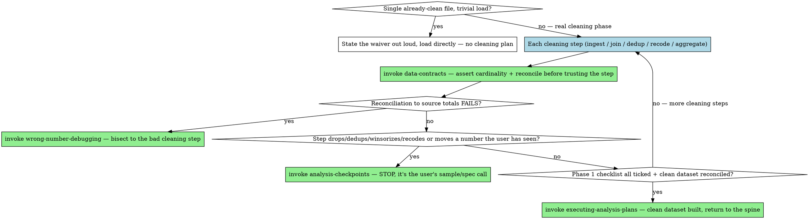

# Data Preparation

## Overview

By the time you report a number, the riskiest decisions are already behind you — they were made while cleaning the data, and nobody wrote down why. A dropped duplicate, a collapsed category, a join that quietly fanned out, a missing-value rule chosen in a hurry: each one moves the eventual estimate, and none of them throws an error. The dangerous bug here is not the run that crashes. It's the clean run, on a cleaned dataset, that hands you a confident wrong answer because the sample was silently reshaped three steps before you ever fit a model.

This skill owns the **data-ingest-and-cleaning phase** — the heaviest, most decision-dense stretch of an analysis. It is reached from `executing-analysis-plans`' sequential spine step 1 (*build / clean / join the analysis dataset*), which **delegates** that step here. When the clean, validated dataset is built, control **returns to `executing-analysis-plans`** for variable construction → primary specification → robustness → verification.

**Core principle:** Cleaning is analysis, not pre-analysis. Plan it, checkbox it, and record *why* for every consequential choice — because the decisions that reshape the sample are made here, and a sample you reshaped without a written reason is a result you can't defend.

## Doer/planner, not checker — the boundary with `data-contracts`

These two skills are complementary and must never compete:

- **`data-contracts` is the CHECKER.** It asserts invariants — join cardinality, row counts, ranges, totals that reconcile — and freezes validated baselines. It fires on *"I'm about to trust a number / do a join."*
- **`data-preparation` is the DOER and PLANNER for the cleaning phase.** It decomposes ingest → clean → join → dedup → recode → reconcile into a phased, checkboxed plan with a decisions log; it deliberates; it is resumable across a session. It fires on *"clean / build / assemble the dataset."*

The relation is exactly the one `executing-analysis-plans` already has with `data-contracts`: **the doer uses the checker.** This skill OWNS the cleaning phase and **CALLS `data-contracts` to validate every step** — every join gets a cardinality assertion before it runs and a row reconciliation after; every recode gets a range/category check; every aggregation reconciles parts to the known whole. You do not hand-roll validation here. You sequence the work, and you let `data-contracts` enforce that each step held before the next builds on it.

The division is clean: `data-preparation` decides *what cleaning steps happen and in what order and why*; `data-contracts` decides *whether each step is trustworthy*. Neither does the other's job.

## Phase 1 of the living analysis plan

This skill produces and maintains **Phase 1 — Data ingest & cleaning** of the file-persisted `analysis-plan.md` that `question-framing`/`pre-analysis-plan`/`executing-analysis-plans` share. (If no plan file exists yet, create `analysis-plan.md` at the project root — legacy projects may carry it at `docs/analysis-plan.md` — and record its path in your todos.) Phase 1 carries its own sub-checklist plus a decisions log:

**Lay out the sub-checklist as a roadmap and get a nod before you execute it** — this is task-altitude planning, and it fires for an **ad-hoc mid-analysis merge or reconcile** ("just join these two sources", "reconcile these totals") just as much as for a from-scratch panel build, not only when someone says the words "clean the data". A merge is a multi-step plan whose cardinality can silently reshape the sample; the user should see the steps (which keys, which side is unique, what you do with unmatched rows) and be able to redirect *before* rows move, not after. Agree once, then work the checklist autonomously — surfacing only the consequential cleaning decisions below.

**Phase 1 sub-checklist** — every box must be checked, in order, before the dataset is "built":

- [ ] **Sources + provenance** — each raw source named (file / table / extract / API), its grain stated, and any upstream surgery you know about (a sample already taken, rows pre-filtered, categories pre-collapsed). An analyst who doesn't know a 30% sample was drawn upstream over-counts by 3×.
- [ ] **Each join** — declared cardinality (1:1 / 1:m / m:1; an unintended m:m is a stop-the-line bug) asserted *before* the merge via `data-contracts`, and a **row reconciliation** after (did rows fan out or vanish?).
- [ ] **Dedup rule** — the exact key that defines a duplicate, which record wins when several collide, and how many rows the dedup removed.
- [ ] **Missingness handling** — count the `NA`/`missing`/`NaN` per column, decide the rule (drop / impute / flag / leave) *explicitly*, and state what the rule does to the sample.
- [ ] **Coding / recodes** — every category collapse, bucketing, unit conversion, and derived variable, with its exact rule and units.
- [ ] **Reconciliation to source totals** — the built dataset's key totals (row counts, sums, group counts) tie back to the raw sources. This is the single check that catches the majority of silent join/filter/dedup damage.

**The decisions log** — the heart of this skill. Every consequential cleaning or coding choice is recorded *with its WHY*, the moment you make it:

```
## Decisions log (Phase 1)
- 2026-06-10 — Dropped 412 rows with negative `quantity`. WHY: confirmed with source
  owner these are reversal entries already netted in `quantity_net`; keeping them
  double-counts returns. Sample: 50,118 → 49,706.
- 2026-06-10 — Collapsed `channel` levels {"web","WEB","Web "} → "web". WHY: trailing-space
  and case variants of one channel; left split, the channel-level rates are wrong.
- 2026-06-10 — Joined orders→customers as many-to-one on `customer_id`, asserted
  validate="many_to_one". WHY: one customer, many orders; an m:m here would triple revenue.
```

**Write to disk after every couple of actions** — this is the rule, not a suggestion. The decisions log and the checklist live in the file, not in the chat and not in your head. Two reasons:

1. **It survives `/clear` and compaction.** A long, fix-heavy cleaning session will hit auto-compaction at a random, lossy moment, and the first things lost are exactly the cleaning gotchas and the *whys* you can least afford to lose. Durable state in the file is what lets the session compact safely.
2. **It is the audit trail.** When a number later comes out wrong, the decisions log is what lets `wrong-number-debugging` bisect in minutes instead of re-deriving every choice from scratch. "Why is revenue down 8% from last quarter's pull?" is answerable in seconds when the dedup and the dropped-rows decisions are written with their reasons, and a multi-hour archaeology dig when they aren't.

The plan file is **disk-as-RAM**: you offload state to it continuously so your working context stays clean and a fresh session can resume from the file alone.

## Consequential cleaning decisions go to the user — `analysis-checkpoints`

Cleaning is where design changes get smuggled in as "just tidying the data." Resist it. A cleaning choice is **consequential** — and routes to `analysis-checkpoints`, the user's call, not a silent fix — whenever it:

- **drops, filters, or winsorizes rows** (changes the sample);
- **dedups** in a way that removes more than a trivial, obviously-exact-duplicate count;
- **recodes or collapses** categories in a way that changes a grouping the analysis reports on;
- **moves a number the user has already seen** (a total, a count, a rate they were shown last week).

These are not bugs to fix on the way through; they are sample/spec decisions. Record your recommendation and the WHY in the decisions log, then **STOP and surface it** — "dropping the 412 negative-quantity rows takes the sample from 50,118 to 49,706 and lowers total revenue 2.1%; here's why I think they're reversals — do you want them dropped?" One sentence now beats a contradicted number in front of a stakeholder later. Routine, non-consequential tidying (parsing a date column, trimming whitespace that doesn't merge groups, fixing an obvious dtype) you just do, and log if it's interesting.

## When a reconciliation fails — `wrong-number-debugging`

The reconciliation-to-source-totals box is where silent damage announces itself. If the built dataset's totals **don't** tie back to the raw sources — revenue tripled after a join, a count is too high, parts don't sum to the whole — **do not patch and proceed, and do not "adjust" the total to match.** A failed reconciliation means a step in the cleaning pipeline corrupted the data, and the fix is to find *which* step. **STOP and invoke `wrong-number-debugging`** to bisect the pipeline backward to the exact bad step. The decisions log is your map for that bisection. Patching the symptom (filtering until the total looks right) is how a join bug becomes a permanent silent bias.

## Resumability — the plan file is the source of truth

Because cleaning spans many small steps and often more than one session, the plan file must let a clean-slate session pick up exactly where you left off. The test, borrowed from `executing-analysis-plans`: **if the conversation were compacted right now, could a fresh session resume from the plan file alone?** That means the file holds, at every save point:

- the checklist with boxes ticked (done ✓ / queued);
- the decisions log up to date with every consequential choice and its WHY;
- the concrete next step written as a resume-from-clean-slate instruction ("POST-COMPACT: assert m:1 on the orders→customers join, reconcile row count, then handle missing `region`").

Update the file after every couple of actions and at every phase boundary; offer to `/compact` only at a clean boundary, never mid-step.

## Size threshold — and the waiver

This skill triggers when **cleaning is more than a couple of steps or will span a session** — multiple sources, any join, a dedup, real missingness, recodes, anything that needs a reconciliation. That's when a phased plan and a decisions log earn their cost.

**A single, already-clean file is waived.** If the user hands you one tidy CSV that just needs loading, do **not** ceremony-plan a trivial load. **State the waiver out loud** — "this is a single clean file, no cleaning phase needed; loading directly" — and proceed. The discipline is for real cleaning work, not for manufacturing process around a one-line `read_csv`. Stating the waiver is itself the audit trail: it records that you *considered* the cleaning phase and judged it unnecessary, rather than skipping it by accident.

## Red flags — STOP

- Cleaning across several steps with **no plan file and no decisions log** — the *whys* are evaporating as you go.
- A drop / dedup / winsorize / recode that **changes the sample or a number the user has seen**, applied silently instead of routed to `analysis-checkpoints`.
- A join run **without a declared cardinality** asserted via `data-contracts` first.
- "The dataset's built, the totals are close enough" — **close** on a reconciliation usually means rows are leaking; find out why before you round it away (`wrong-number-debugging`).
- Hand-rolling validation here instead of **calling `data-contracts`** — the doer reinventing the checker.
- Patching a failed reconciliation by adjusting the total to match, instead of bisecting to the bad step.
- Ceremony-planning a trivial load of one clean file — over-applying the skill instead of stating the waiver.

## Common rationalizations

| Excuse | Reality |
|---|---|
| "I'll remember why I dropped those rows." | You won't, and neither will the compacted session. The reason is the asset; write it in the log now. |
| "It's just data cleaning, the analysis is the real work." | Cleaning is where the sample gets reshaped — it *is* analysis, and it's where the silent wrong answer is born. |
| "Deduping is obviously safe, no need to flag it." | A dedup that removes non-exact duplicates changes the sample. If it moves a number, it's the user's call. |
| "The join ran fine, no error." | A join is the one operation that changes your row count in either direction without erroring. Assert the cardinality. |
| "I'll write the decisions log at the end." | At the end you've forgotten the whys and compaction may have eaten the session. Disk-as-RAM, every couple of actions. |
| "Totals are off by a rounding-ish amount, I'll just align them." | Aligning the total hides the leak. A failed reconciliation is a bug to bisect, not a number to nudge. |

## When to Use → where this hands off

Data preparation is **not** a terminal step. It owns the cleaning phase, calls the checker on every step, stops for the user on consequential choices, bisects on a failed reconciliation, and — when the clean dataset is built — *propels back into the spine*. Route imperatively, don't just note the relationship:



## The Process

1. **Check the size threshold first.** Trivial load of one clean file → *state the waiver out loud and load directly.* Otherwise, open/extend `analysis-plan.md` with **Phase 1 — Data ingest & cleaning**: its sub-checklist (sources + provenance; each join with asserted cardinality + row reconciliation; dedup rule; missingness handling; coding/recodes; reconciliation to source totals) and a decisions log.
2. **Work the checklist in order, validating every step → invoke `data-contracts`.** Declare and assert join cardinality before each merge; reconcile row counts and totals after. The doer calls the checker — do not hand-roll validation.
3. **Log every consequential choice with its WHY, writing to disk after every couple of actions.** The decisions log is disk-as-RAM: it survives `/clear` and compaction and is the audit trail `wrong-number-debugging` will use.
4. **Any step that drops/filters/winsorizes/dedups-non-trivially/recodes-a-reported-grouping, or moves a number the user has already seen → STOP and invoke `analysis-checkpoints`.** Record your recommendation and the WHY, then let the user decide. Don't smuggle a sample change in as tidying.
5. **If reconciliation to source totals FAILS → STOP and invoke `wrong-number-debugging`.** Bisect the cleaning pipeline to the exact bad step using the decisions log as your map; never patch the total to match.
6. **When Phase 1's checklist is fully ticked and the clean dataset reconciles → invoke `executing-analysis-plans`.** The clean, validated dataset is built; return to the spine for variable construction → primary spec → robustness → verification. Do not start estimating here.

## The bottom line

```
Clean dataset, built well  →  phased checklist ticked, every consequential choice logged with WHY, every join asserted and reconciled, sample changes brought to the user, plan file resumable from a clean slate
Otherwise                  →  a cleaned dataset nobody can audit, hiding the sample-reshaping decision that quietly determined the answer
```

The cleaning is the analysis. Write down why, or you can't defend the number.
