# Descriptive Evidence

## Overview

Causal identification asks *what an intervention did*; structural estimation asks *what a world we haven't seen would do*; prediction asks *what is likely true of a unit, so I can act on it*. Beneath all three sits the work the discipline rushes past: **describing what is actually in the data.** The trend, the gap, the distribution, the summary-statistics table, the three or four *stylized facts* that open almost every empirical paper. The deliverable is not an effect and not a forecast — it is a faithful picture of the data as it is, and most of the time that picture is the whole job. The rest of the time it is the thing that *motivates* the causal, structural, or predictive question that comes next.

This is a legitimate destination, not a way-station. "Just show me the trend" does not mean "skip the rigor and reach for a plotting library" — it means the rigor is *about the description itself*, and description has its own discipline because it has its own signature failure.

The **signature failure of this arm is the composition / aggregation artifact.** A trend or a gap that looks like a within-group change is really an artifact of a shifting *mix*: the aggregate average wage rose because low-wage workers exited the sample, not because anyone got a raise; the national rate fell while it rose in every region (Simpson's paradox); "revenue grew 40%" in nominal dollars while real revenue shrank; the count climbed because the population did. The fact looks exactly as clean as a real one — it reconciles, it reproduces, it plots beautifully — and it is describing the denominator or the deflator or the changing sample, not the thing you named. Nothing in the chart tells you so. This is the descriptive analog of leakage: a confident artifact.

There is a **twin failure**: the descriptive-to-causal slide. The analyst plots Y rising alongside X and writes "X **raised** Y." A described co-movement is a correlation; the moment it wears a causal verb it has left this arm and made a claim it cannot support. A stylized fact's *highest* use is to motivate a causal question — but motivating it routes to `causal-identification`; it does not license a causal sentence in a descriptive section.

**Core principle:** *a descriptive fact is trustworthy only when it survives the ordinary alternative explanations for the pattern — composition, deflation, scaling, selection, definition — and is stated as the correlation it is, not the cause it isn't.* Everything below serves that one sentence.

## What are you producing? — name the deliverable

Three shapes, with different standards of polish. Name yours; it sets how hard each section below bites.

| Deliverable | What it is | Standard |
|---|---|---|
| **Stylized-facts list** | 3–5 curated, robust facts that motivate a paper or a decision — each one sentence + one exhibit | Every fact must be **robust** (survives alternative cuts) and **composition-checked**. The highest bar. |
| **Summary-statistics table** | The "Table 1" — sample, unit, weighting, by-group columns, what's in and out | Comparability choices explicit; sample and weighting stated in the note; reconciles to source. |
| **Exploratory trends pass** | The "what's going on in this data" first look — not yet paper-bound | Lighter gate on polish, not on honesty: any aggregate comparison you *deliver* (chat answer included — "reported" means any number the user will see or act on) gets the composition check; a surprise raises its priority, it never gates it. |
| **Adjusted associations / correlates-of table** | A regression with controls, reported in descriptive verbs — "conditional on X, Y is higher among…" | Owned here, with two travelling rules: bad-controls logic still applies (conditioning on a collider or mediator garbles even a *descriptive* association — see `causal-identification`'s Bad Controls), and adjusted associations sit one verb from a causal claim — the firewall below holds. |
| **Descriptive map / spatial exhibit** | A choropleth or point map — where something is concentrated, how a rate varies across places | The mapped quantity is a **rate/normalized**, not a raw count that just maps population; spatial unit + color breaks stated; the point↔polygon / ownership join checked for silent drops and fan-out (see *Descriptive maps* below). |

This is **not** a fork into other skills — it is one skill at three polish levels. The fork (causal / structural / predictive) is what you route to *after* the description, if a question emerges from it.

## Where this sits

`question-framing` fires **first** (or alongside) — it pins the unit, the population, the decision the artifact informs, and the joins that assemble the data. Descriptive-evidence is the **execution craft** once you know the output is a description: how to compute and present it so the fact is real. The joins behind a trend get the same scrutiny any join does — hand them to `data-contracts`; a stylized fact built on a fan-out join is a fabricated fact. A fact you will publish gets reconciled and reproduced — hand it to `result-verification` before it lands in a deck or a paper. For a **map**, the same split holds: `question-framing` frames it (what each mark represents, what it encodes, which joins assemble it), and descriptive-evidence governs making that descriptive map *honest* — rate-not-count, spatial unit, color breaks, and the silently-dropping spatial join (see *Descriptive maps* below). And the write-up — the prose of the stylized-facts section — is `econ-writing`'s job; this skill produces the facts, not the section.

## Fix the comparability choices — before you plot

A handful of choices silently decide *what the fact says*, and every one of them is a place a clean-looking trend goes wrong. Fix them, and annotate each at the code site with the `# why:` convention (the code-level echo of a decisions log), because "indexed to 2015 dollars" six months from now is unrecoverable from a bare number:

1. **Denominator.** A count, a level, a rate, a share — of *what*? "Opioid deaths rose" (count) and "the opioid death *rate* rose" (per 100k) can point in opposite directions when population moves. Name the denominator and hold it fixed across the comparison.
2. **Real vs. nominal + base year.** Any dollar figure compared across time must be **deflated** to a stated base year, or the "growth" is partly inflation. State the deflator (CPI, PCE, a sector index) and the base — they change the magnitude and sometimes the sign.
3. **Per-capita / scaling.** Compare jurisdictions, firms, or eras of different size *per unit* (per capita, per worker, per dollar of revenue), or the biggest unit dominates every panel and the "fact" is just "California is large."
4. **Weighting.** An unweighted mean of a weighted sample (survey weights, value-weight vs. equal-weight) is a *different number* answering a different question. Decide which population the fact is about and weight to it; state it in the note.
5. **Unit of observation.** What is one row in the picture — a person, a person-year, a firm, a market? The same data described at two grains gives two facts; a fuzzy unit is where double-counting hides.
6. **Window + frequency.** The sample period and the frequency (monthly / quarterly / annual) change the shape; a trend that exists only because it starts in a trough or ends at a peak is an artifact of the window, not a fact.
7. **Aggregation level.** The level at which you average is exactly where composition effects live (next section) — choosing it is choosing whether you'll see them.

These are the **descriptive analog of the spec** the other arms sign off — but deliberately *lighter*, because exploratory description shouldn't carry a heavy gate. The rule scales with the deliverable: for a quick exploratory pass, decide them and note them; for a stylized fact that will be **reported**, they get pinned and the robustness check (below) gets run, the same way a reported effect earns its robustness battery.

## The composition check — the signature discipline

This is the highest-value check in the arm, the analog of the permutation/null probe in prediction. **Whenever an aggregate — a mean, a rate, a total, a gap between groups, a trend over time — moves or differs, ask one question before you believe it:**

> Is this a change *within* the groups, or a change in the *mix* of groups?

An aggregate can move with *nothing* moving inside any subgroup, purely because the weights shifted. So when the number matters, **decompose it** rather than asserting it:

- **Within-vs-between decomposition.** Split the aggregate change into the part from within-group changes (holding the mix fixed) and the part from the changing mix (holding group values fixed). If the "trend" is mostly between, your headline is a composition story, and the honest sentence is about the mix, not the level.
- **Shift-share** for aggregates built from a changing set of components (industries, regions, products) — separate the component-level change from the reallocation across components.
- **Oaxaca-style** when you're decomposing a *gap* between two groups (a wage gap, a price gap) into a part explained by composition (differing characteristics) and a part that is not.
- **Look inside before you average.** Plot the subgroups, not just the total. Simpson's paradox is invisible in the aggregate and obvious the moment you facet.

And **check for selection into the sample over time**: if who is *in* the data changes across the window — firms enter and exit, a survey changes coverage, a measurement definition shifts — a trend in the average can be entirely a trend in *who is being averaged*. A break in a series that lines up with a coverage or definition change is a measurement artifact until proven otherwise.

If the surprise survives the decomposition, you may have a real fact. If it doesn't, you've caught the artifact before it became a headline.

## A stylized fact must be robust — or it isn't stylized

The word *stylized* is a promise: the fact is stable, not an artifact of one arbitrary choice. So a fact you will report has to **survive the obvious alternative versions of itself** — a different reasonable denominator, deflator, weighting, sample window, or cutpoint. This is the descriptive sibling of the causal robustness battery, and it is *cheap*: re-cut the same fact three sensible ways and look.

If the fact holds across them, say so — that robustness *is* the credibility. If it flips when you change the deflator, or vanishes when you drop the first year, or reverses when you weight — it is **fragile, not stylized**, and the honest move is to downgrade the claim ("over 2015–2019, on a per-capita basis, …") rather than report the fragile version as though it were general. A stylized fact that only exists in one specification is a fished fact wearing a descriptive hat.

## Is the number plausible? — triangulate the level against an external anchor

The composition check and the robustness re-cuts both interrogate the data *against itself* — they ask whether the number is **computed right**. They cannot tell you whether the quantity you computed *means what you named it*. A count can reconcile to source, reproduce from a clean session, and survive every alternative cut, and still be the wrong measure of the thing — because the construct it captures is only the visible *slice* of what you called it. That gap is **reliability** (the number is computed correctly) versus **validity** (the number measures the construct). An arm that runs only internal checks will certify a reliable measure of the wrong quantity and never notice — every check passes, and the headline still describes something narrower than its own sentence claims.

Validity is checked against something *outside* the dataset. When the **level** of a descriptive measure matters — and especially when it surprises you, high or low — run at least one of these before you report it:

- **Known-shock check.** If something happened in the window that *should* move this quantity — a launch, a policy, a definitional or coverage change — does the series show it, at the right time and the right sign? A measure that doesn't budge across a shock that should move it (or moves when nothing happened) is tracking something other than what you named. This is the descriptive cousin of a placebo.
- **External benchmark.** Does the level sit in a defensible range next to an *independent* estimate of the same quantity? An order-of-magnitude gap from every external benchmark is a finding to **explain with a mechanism** (a narrower construct, a coverage limit), not a number to report flat. State the benchmark and its comparability caveat — a benchmark for a different construct isn't a contradiction.
- **Alternative-construct coverage.** Does the measure capture the construct, or only the slice visible in this source? Expand the definition along the dimension you suspect is missing — the other place the signal would show up — and see how far the level moves. A measure whose level is an artifact of *where you looked* is a coverage limit wearing the name of the whole.

If the level survives the anchor, the fact is not just robust, it's *plausible* — say so, and name the anchor. If it doesn't — an implausibly low or high number — that is a result to investigate (`wrong-number-debugging`) or a measurement limit to state **in the fact's own sentence** ("publicly visible AI-trace PRs", not "AI-assisted PRs"), never a number to report with a shrug. Note the asymmetry: *proposing* one of these anchors costs almost nothing and is fully reversible, so propose it even when no one asked. *Changing the construct's definition* to chase the benchmark is the opposite — a metric change, `analysis-checkpoints`, the user's call.

## Show the distribution, not just the center

Economic data is heavy-tailed almost everywhere it matters — income, wealth, firm size, prices, city population, claim amounts. A **mean of a heavy-tailed variable can describe no one in the sample**, and a mean that moves can move because one tail observation arrived. So:

- Report the **median and key percentiles** alongside the mean; report the **spread** (SD, IQR), not just the center.
- **Show the distribution** — a histogram, density, or ECDF — when the shape carries the point (skew, bimodality, a mass at zero, a pile-up at a cap). The shape is often the fact.
- Prefer a **log scale** for quantities that vary multiplicatively or span orders of magnitude; a linear axis crushes the bottom 90% against the floor and the "fact" becomes "the top is big."
- A change in a mean with no change in the distribution's shape, and a change in shape with no change in the mean, are *different facts* — don't let the mean stand in for both.

## Honest visualization

The exhibit should make a real fact **legible at a glance**, never manufacture one. The chart and the sentence beneath it must say the same thing.

- **Axis honesty.** Don't truncate a y-axis to exaggerate a wiggle into a trend; conversely, don't force a zero baseline onto an index or a log scale where it misleads — *state* the scale instead. The default is the scale that represents the magnitude faithfully, and the choice is annotated.
- **Index to a base year** when comparing growth across series of different levels — raw levels make the big series look like "the trend" when the small one grew faster.
- **Log vs. linear matched to the quantity** — multiplicative growth reads as a straight line in logs; forcing it linear hides constant-rate growth as an explosion at the end.
- **Don't smooth away the variation you're claiming.** A loess line through noisy data can invent a trend that the scatter doesn't support; show the underlying points or the band.
- **Dual-axis traps.** Two series on two y-axes can be made to "co-move" by choosing the scales — a co-movement that exists only because of axis choices is not a fact.

## Descriptive maps — the same discipline, spatial

A choropleth or point map is a descriptive exhibit built from data, so every rule above has a spatial twin — and maps fail *more* quietly than charts, because a plausible-looking map is extraordinarily convincing. The map is the deliverable; the failure modes are just wearing geography.

- **Map a rate, almost never a raw count.** A choropleth shaded by the *number* of events is, to first order, a map of where the population is — the largest, most populous areas light up regardless of the phenomenon. Normalize to a rate or per-capita (the **spatial denominator**, the same denominator discipline as everywhere else) unless the raw count is genuinely the point.
- **The spatial unit is the aggregation level (MAUP).** The same data binned by county, tract, or ZIP can show different — even opposite — patterns; this is the modifiable areal unit problem, the spatial face of the composition/aggregation choice. Pick the unit deliberately, and know the pattern may be partly an artifact of it.
- **Color binning is axis honesty.** Quantile vs. equal-interval vs. Jenks breaks, and the number of bins, change which areas read as extreme — the spatial analog of a truncated axis. State the scheme; don't hunt for the breaks that dramatize the story.
- **The join is where maps silently lie — hand it to `data-contracts`.** A point-to-owner join that fans out double-plots a facility owned by several firms over time; a point-in-polygon (spatial) join *drops* every feature that falls outside all polygons with no error at all. A map earns *more* join scrutiny than a table, because a bad join just looks like a slightly emptier or denser map.
- **A map shows where, not why.** The same causal firewall: "facilities are concentrated in X" is a description of geography, not a claim that anything about X *caused* the concentration.

## Describe, don't infer — the causal firewall

The headline guardrail of this arm. A descriptive exhibit shows *what co-moves, what differs, what is distributed how* — it does **not** show *why*, and the verbs have to respect that.

- **Descriptive verbs only:** "rose alongside," "is higher among," "co-moved with," "is concentrated in," "has widened." **Never** causal ones: "raised," "drove," "caused," "led to," "increased" (transitive), "the effect of." The verb is the claim.
- A correlation shown is a correlation, full stop — a scatter with a fitted line is a *description of association*, not an effect, no matter how tight the fit.
- The **right** use of a striking stylized fact is to motivate a causal, structural, or predictive question — "Y rose sharply when X was introduced; *did* X cause it?" That question routes to `causal-identification` (or the relevant arm), which earns the causal verb through a design. The descriptive section sets it up; it does not answer it.
- This is the resolution of the tension that sends people straight to causal frames: descriptive work is **legitimate on its own**, *and* it stays honestly descriptive. You don't need a causal design to show a trend — you need one to *explain* it.

## Tooling (R / Python / Julia)

| Task | R | Python | Julia |
|---|---|---|---|
| Summary-stats / Table 1 | `gtsummary`, `modelsummary` (`datasummary`), `vtable` | `tableone`, `pandas.describe`, `skimpy` | `StatsBase` (`describe`), `PrettyTables.jl` |
| Distributions | `ggplot2` (`geom_histogram`/`density`/`stat_ecdf`), `ggridges` | `seaborn` (`histplot`/`kdeplot`/`ecdfplot`) | `StatsPlots.jl`, `Makie.jl` |
| Trends / indexing / smoothing | `ggplot2` (`geom_line`/`geom_smooth`), base-year index | `matplotlib`/`seaborn`, `pandas` rolling | `Plots.jl`/`Makie.jl` |
| Decomposition (within/between, shift-share, Oaxaca) | `oaxaca`, manual `dplyr` | `statsmodels`, manual `pandas` groupby | manual `DataFrames.jl` |
| Weighting / survey | `survey`, `srvyr` | `samplics`, `statsmodels` (freq weights) | manual / `StatsBase` weights |
| Real vs. nominal (deflators) | `priceR`, `fredr` (CPI/PCE) | `fredapi`, `pandas_datareader` | `FredData.jl` |
| Maps / choropleths (rate-not-count, classed breaks) | `sf` + `ggplot2`/`tmap`, `leaflet` | `geopandas`, `folium`/`leafmap` | `GeoMakie.jl`, `Shapefile.jl` |

Reach for the simplest row that answers the question. The decomposition row is the one most often skipped and most often needed — when a number surprises you, it's the first tool, not the last.

## Red flags — STOP

- A dollar trend reported **without deflating** to a stated base year — "growth" that is partly or entirely inflation.
- A **count compared across units or time** where the denominator (population, sample size) is itself moving — a rate dressed as a level, or vice versa.
- An aggregate mean/rate/gap moved or differed across groups and **no composition check was run** — within-vs-between never decomposed, subgroups never plotted.
- A trend in an average where **who is in the sample changed over the window** (entry/exit, coverage change, definition change) and selection was never ruled out.
- A **mean reported for a heavy-tailed variable** with no median, no percentiles, no view of the distribution's shape.
- A **stylized fact reported from one specification** with no check that it survives an alternative denominator, deflator, weighting, or window.
- A **truncated or cherry-picked axis / window** that manufactures a trend; a dual-axis "co-movement" that's an artifact of the scales.
- A **choropleth shaded by raw counts** that is really mapping population, not the phenomenon; color breaks chosen to dramatize the hotspots.
- A **spatial (point-in-polygon) or ownership join behind a map** with cardinality unchecked — features silently dropped outside all polygons, or double-plotted by a fan-out join.
- A described correlation written with a **causal verb** ("X raised Y," "the effect of," "drove") — the descriptive-to-causal slide.
- An **unweighted statistic from a weighted sample**, with no statement of which population the fact is about.
- A fact about to be **reported or put in a paper** that was never reconciled to source (`data-contracts` / `result-verification`).

## Common rationalizations

| Excuse | Reality |
|---|---|
| "It's just a quick trend, no need for rigor." | The rigor *is* about the trend. A mis-deflated, composition-driven trend looks exactly as clean as a real one — that's why it's dangerous. |
| "Revenue grew 40%, that's the fact." | In nominal dollars? Deflate to a base year first. The real number can be half that, or negative. |
| "The average went up, so the typical unit improved." | Or the mix changed and no unit moved. Decompose within-vs-between before you write the headline. |
| "The national rate fell, so it fell." | Check the subgroups — it can fall in aggregate while rising in every group (Simpson's paradox). Look inside before you average. |
| "The mean is 4.2, so that's typical." | For a heavy-tailed variable the mean describes no one. Show the median and the distribution. |
| "Y rose right when X started, so X raised Y." | That's a co-movement, not an effect. Want the causal verb? That's `causal-identification` and a design — this is the motivation, not the answer. |
| "The fact holds in my specification." | Then it should hold in three reasonable others. If it flips when you change the deflator or the window, it's fragile, not stylized — downgrade the claim. |
| "I zoomed the axis so the trend is visible." | If the trend needs a truncated axis to be visible, ask whether it's a trend or noise. Represent the magnitude faithfully and state the scale. |
| "The sample changed over the years but the trend's still real." | Maybe — but a trend in the average can be entirely a trend in *who's averaged*. Rule out selection before you call it a fact. |
| "The map shows the hotspots clearly." | A choropleth of raw counts maps population first. Normalize to a rate, pick the spatial unit deliberately, and check the color breaks aren't manufacturing the hotspots. |

## When to Use → where this hands off

Descriptive evidence is rarely terminal — a clean fact either *is* the deliverable (then verify it) or *motivates* the next question (then route to the fork). Route imperatively:

```dot
digraph descriptive_evidence_next {
    "Comparability choices fixed + composition-checked?" [shape=diamond];
    "Surprising / will-be-reported fact?" [shape=diamond];
    "invoke result-verification — reconcile to source + reproduce, before it lands in a deck/paper" [shape=box style=filled fillcolor=lightgreen];
    "A number looks off / doesn't reconcile?" [shape=diamond];
    "invoke wrong-number-debugging — suspect a composition/denominator/join artifact first" [shape=box style=filled fillcolor=lightgreen];
    "A causal / structural / predictive question emerged from the fact?" [shape=diamond];
    "route to the fork — causal-identification | structural-estimation | predictive-modeling (the fact MOTIVATES it; it does not answer it)" [shape=box style=filled fillcolor=lightyellow];
    "Writing up the stylized-facts section?" [shape=diamond];
    "hand to econ-writing — this skill produced the facts, not the prose" [shape=box style=filled fillcolor=lightyellow];

    "Comparability choices fixed + composition-checked?" -> "Surprising / will-be-reported fact?" [label="yes — proceed"];
    "Surprising / will-be-reported fact?" -> "invoke result-verification — reconcile to source + reproduce, before it lands in a deck/paper" [label="yes"];
    "Surprising / will-be-reported fact?" -> "A number looks off / doesn't reconcile?" [label="check"];
    "A number looks off / doesn't reconcile?" -> "invoke wrong-number-debugging — suspect a composition/denominator/join artifact first" [label="yes"];
    "Comparability choices fixed + composition-checked?" -> "A causal / structural / predictive question emerged from the fact?" [label="fact is clean"];
    "A causal / structural / predictive question emerged from the fact?" -> "route to the fork — causal-identification | structural-estimation | predictive-modeling (the fact MOTIVATES it; it does not answer it)" [label="yes"];
    "A causal / structural / predictive question emerged from the fact?" -> "Writing up the stylized-facts section?" [label="no — describe + report"];
}
```



## The Process

1. **Name the deliverable** — stylized-facts list, summary-stats table, or exploratory pass — so the rigor matches the polish. Co-fire `question-framing` for the unit, population, and decision if they aren't already pinned.
2. **Fix the comparability choices before plotting** — denominator, real-vs-nominal + base year, per-capita scaling, weighting, unit, window, aggregation level — and annotate each with `# why:`.
3. **Run the composition check on anything that moves or differs** — within-vs-between (or shift-share / Oaxaca), plot the subgroups, and rule out selection-into-sample over the window. This is the signature step; do it before you believe a surprising number.
4. **Show the distribution, not just the center** — median + percentiles + shape for anything heavy-tailed; log scale where the quantity is multiplicative.
5. **For a fact you'll report, prove it's robust** — re-cut it three reasonable ways (denominator, deflator, weighting, window). Report the robustness as the credibility, or downgrade the claim to the range where it holds.
6. **Visualize honestly** — faithful axes/scales, index for growth comparisons, don't smooth away or zoom in the variation you're claiming; exhibit and sentence must agree. **For a map**, shade a rate not a raw count, choose the spatial unit and color breaks deliberately, and hand the spatial/ownership join to `data-contracts`.
7. **Keep the verbs descriptive** — "rose alongside," not "raised." If a causal/structural/predictive question emerged, route it to the fork as a *motivated* question; if the fact is the deliverable, hand it to `result-verification` (and `data-contracts` for its joins) before it ships.

## The bottom line

```
Descriptive fact  →  comparability fixed (deflated, per-capita, weighted, one unit) +
                     composition-checked (within-vs-between, subgroups, selection) +
                     robust to alternative cuts + distribution shown + descriptive verbs only
Otherwise         →  a clean-looking artifact of the denominator, the deflator, or the changing mix —
                     and, one causal verb later, a finding the data never supported
```
