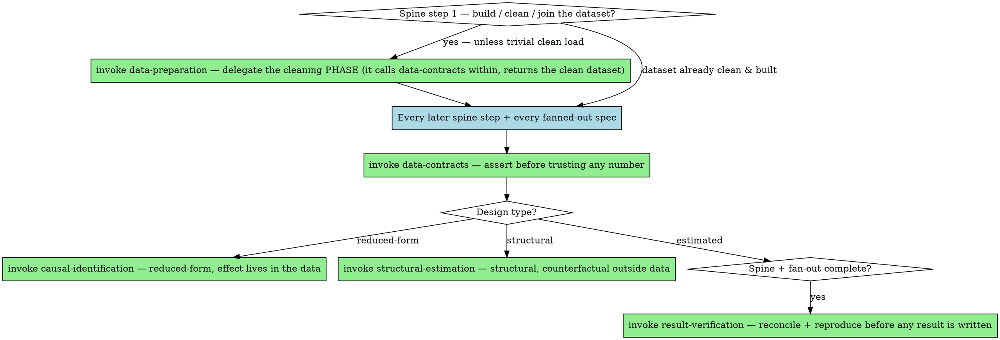

# Executing Analysis Plans

## Overview

A plan that's been approved is a commitment, and execution is where it either gets honored or quietly abandoned. This skill takes over once `question-framing` (and, for confirmatory work, `pre-analysis-plan`) have produced an **approved** plan, and carries it out: build, estimate, stress-test, assemble. It is the analytics counterpart of executing an implementation plan — including dispatching independent work to parallel subagents.

**Core principle:** Execute the approved plan faithfully, validating as you go and parallelizing what's independent. Autonomy here is for *carrying out the agreed plan fast and thoroughly* — not for changing it. Any departure is a checkpoint, not a step.

## Prerequisite: there is an approved plan

Don't start here from a cold "analyze this." If there's no approved brief/PAP yet, go back to `question-framing` (and `pre-analysis-plan` for confirmatory work) and get sign-off first. Executing a plan nobody approved is just the behind-the-back problem wearing a schedule.

**A new request on an already-locked plan still triggers this skill — re-fire, don't coast.** A re-run, a finer reporting cut, "now do the other radii / the facility-year version" is exactly this skill's job (approved plan → run it, fan independent work to subagents), and it ends in `result-verification` before any result is written to a file. "The design was locked and reviewed last week, I'll just run it" is how a new cut ships unverified — the lock covers the *design*, not this *run*. If the new cut changes the unit or estimand, it's a `question-framing`/`analysis-checkpoints` change first, not a re-run.

## The sequential spine vs. the parallel fan-out

The single biggest execution mistake is running everything in one slow serial loop — or, worse, parallelizing things that actually depend on each other. Split the plan into its dependent spine and its independent leaves.

**Sequential spine (must run in order — each depends on the last):**
1. Build / clean / join the analysis dataset. Unless it's a trivial load of one already-clean file, this is a phase, not a line: **delegate it to `data-preparation`**, which runs the ingest→clean→join→dedup→recode→reconcile checklist (calling `data-contracts` to validate each step, routing consequential cleaning decisions to `analysis-checkpoints`) and returns the clean, validated dataset. Nothing downstream is trustworthy until that phase's reconciliation passes.
2. Construct the treatment, outcome, and key covariates → validate ranges, missingness, leakage.
3. Estimate the **primary specification** (the one pre-committed in the PAP) → this is *the* number.

**Parallel fan-out (independent — but chosen, not exhaustive):**
Once the validated dataset and primary spec exist, the supporting analyses are independent and *can* run concurrently — but "can run in parallel" is not "should all run." First pick the shortlist that earns its place (next section), then fan out **only those**, one subagent per task. Candidates to choose *from*:
- a **robustness specification** that probes the main threat (not every control permutation);
- the **placebo / falsification test** that would catch the confound you actually worry about;
- a genuinely **alternative design**, when one exists;
- a **pre-specified** subsample / heterogeneity cut (not a fishing sweep);
- the **secondary outcome** the mechanism predicts;
- the one **sensitivity analysis** that matters (Oster δ, e-value, bandwidth);
- for **structural** work, the independent pieces are the **Monte-Carlo recovery reps** (across true-θ points and sample sizes), the **multiple starting values** on the non-convex objective, and the **counterfactual scenarios** (one per mechanism) — they fan out the same way (`structural-estimation`).

The approved shortlist reads the *same* validated dataset, so it parallelizes cleanly. **But choosing the execution *mode* is itself a checkpoint — present it, don't assume it.** Before running the shortlist, ask the user how they want it run:

- **Inline** — each chosen spec in turn, here in this session, every step fully observable as it goes.
- **Subagent dispatch** — one parallel subagent per spec, run concurrently.

Recommend **subagent dispatch** for genuinely independent specs (faster, and it isolates each spec's context from yours), but it is the user's call — inline keeps everything in view, which some prefer for a small or delicate run. Make this a real, up-front question, not a silent default; this mirrors the inline-vs-subagent choice superpowers presents at execution.

Once they choose: for **subagent dispatch**, hand each chosen task to the **`robustness-runner`** agent that Causal Powers ships — it executes one pre-specified spec, asserts the data contracts, and returns a structured result, stopping if it hits a design decision (use superpowers' **`dispatching-parallel-agents`** / **`subagent-driven-development`** for the mechanics). For **inline**, run the chosen specs one at a time, applying the same data-contract assertions to each. Either way the shortlist and what each spec carries (next sections) are unchanged — only the execution mode differs.

## Robustness is an argument, not an inventory

The parallel machinery makes running checks cheap, and cheap is exactly the trap: it turns the robustness suite into a free buffet. Don't. **More robustness checks do not mean more credibility** — a wall of specifications usually buries the one check that matters, and a senior reader treats a 30-column robustness table as a *tell* of weak identification, not a show of strength. Before running anything beyond the primary spec:

1. **Name the main threat** — the single most credible way this estimate could be confounding rather than effect.
2. **Choose the ~3 checks that would actually break the result if it's fragile** — the ones that probe *that* threat. A good robustness check has a real chance of failing; a cosmetic "add one more control" that cannot fail proves nothing.
3. **Propose the shortlist to the user** — each with a one-line rationale ("drop the cities with the 2016 recording jump — tests whether the recording change, not the policy, drives it") — and get approval *before* running.
4. Run only the approved set. Run more **only if the user asks**. (If the robustness suite was already locked in `pre-analysis-plan`, run *that* set as-is — the checkpoint is for **additions or deviations**, not a redundant re-ask of the pre-approved plan.)

Default to roughly three. This is judgment, not a quota — occasionally a design genuinely needs a fourth, and you should say so — but the instinct is parsimony, because the job is to *convince*, not to *exhaust*. Choosing which checks to run is itself a consequential decision, so it goes through the user (`analysis-checkpoints`), never a silent fan-out of everything imaginable.

## What every dispatched subagent must carry

A parallel subagent is a place for silent errors and silent redesigns to hide, so constrain it:

- **The exact, pre-specified task** — the precise spec/test from the approved plan, not "explore X." It executes a recipe; it does not choose the recipe.
- **The data contracts to assert** — the same `data-contracts` invariants, so a fanned-out spec can't quietly run on a corrupted subset.
- **A structured result to return** — coefficient, SE, N, the diagnostics, and a pass/fail on its contracts — so you can assemble them without re-reading ten transcripts.
- **The checkpoint rule** — if the subagent hits a decision that would change the design, sample, spec, or estimand (e.g. its diagnostic fails and the "fix" is a redesign), it **reports back and stops**; it does not resolve it. That decision returns to you and then to the user via `analysis-checkpoints`.

## Between every step: validate, then checkpoint

Execution is not "run to the end and show the user." After each spine step and as fan-out results land:

- **Validate** the result against its contract (`data-contracts`); reconcile totals; if a number looks wrong, switch to `wrong-number-debugging`.
- **Checkpoint** any consequential decision that surfaced (`analysis-checkpoints`) — execution is exactly when "the data surprised us, let's change the design" arises, and that is the user's call, not a step you take to keep moving.

## Keep the plan live, and compact at phase boundaries

A long analysis with many mid-step fixes drags context until quality degrades and auto-compaction fires at a random, lossy moment — losing the gotchas and decisions you can't afford to lose. Don't wait for that. **Actively maintain the plan/brief/model card as you go** — mark steps done, record the gotcha you just hit, revise the next step — it's a living document you keep current, not something you wrote once at the start.

Make the trigger **mechanical**, not a vibe: run the update-and-offer-compact routine **after each completed spine step and after the fan-out is assembled** (the checkpoints the skill already defines), not whenever a phase "feels" done. At each:

1. **Update the durable plan document so it stands on its own** — the **same plan file** produced by `question-framing`/`pre-analysis-plan` — root `analysis-plan.md` (create it if none exists), and **record its path in your todos** so a post-compact session knows what to open. Write the **decisions locked** (and why), the **state and key insight** so far, and the **concrete next steps as resume-from-clean-slate instructions** (e.g. "POST-COMPACT: build the PPML death moment on Option B, then FD-verify the jacobian, then MC-recover all params under the mixed objective"). Mirror it in your todos (done ✓ / queued). It lives in the repo, not the chat.
2. **Offer to compact**: "this is a clean point to `/compact` — the plan doc carries the decisions, the insight, and the next steps, so we resume on a clean slate without losing anything." You can't compact yourself (the user runs `/compact`), so *suggest* it — at real phase boundaries only, never mid-step, and easy to wave off.
3. On resume, **re-read the plan document** and continue from its next-steps list.

The test: **if the conversation were compacted right now, could a clean session pick up from the plan document alone?** If not, the document isn't finished — write the missing state *before* you suggest the compact. This is what makes the whole "write it down before you build" rule pay off: durable state in the file is exactly what lets a long, fix-heavy session compact safely.

## Synthesis

When the fan-out completes, assemble — don't just dump:
- Build the **robustness table**: primary estimate beside every alternative, so stability (or fragility) is visible at a glance.
- **Reconcile across specs**: if the headline swings under a reasonable alternative, that's a finding to surface, not a result to bury.
- Note which subagents' contracts **failed** — a robustness spec that violated an invariant is not a clean "it's robust."
- Hand off to **`result-verification`** before any of this is reported.

## Red flags — STOP

- Starting execution with no approved plan to execute.
- **Fanning out an exhaustive *menu* of robustness checks instead of proposing the ~3 that probe the main threat and getting approval first.** More checks ≠ more credibility.
- Parallelizing steps that actually depend on each other (e.g. estimating before the dataset is validated).
- A subagent that resolved a design/sample/spec decision on its own instead of reporting it back.
- Improvising new specifications mid-execution that weren't in the plan, without surfacing them.
- Presenting fanned-out results without reconciling them or checking each one's contracts.

## Common rationalizations

| Excuse | Reality |
|---|---|
| "More robustness checks make it more convincing." | They make it less convincing — a wall of specs reads as theater and hides the one check that matters. Pick the few that could actually break the result. |
| "Running them is cheap now, so why not run them all?" | Cheap-to-run is the trap. The cost isn't compute; it's the reader's trust and the buried signal. Propose ~3 and get approval. |
| "The subagents can figure out the spec." | An under-specified subagent invents its own analysis — the parallel version of deciding behind the user's back. Hand each one the exact recipe. |
| "A robustness check failed its data contract, but the coefficient looks fine." | A spec that ran on corrupted data isn't evidence of robustness; it's noise. The contract failing is the result. |
| "The data suggested a better spec, so I added it." | Adding it silently is specification search. Surface it as a checkpoint; run it labeled as exploratory if approved. |
| "I'll show all the results at the end." | Then a wrong intermediate poisons everything after it unseen. Validate each step as it lands. |

## When to Use → where this hands off

Execution is **not** a terminal step. The spine validates, the fan-out reconciles, and then it *propels* into verification — and forks by design type along the way. Route imperatively, don't just note the relationship:



## The Process

1. **Build / clean / join the dataset → delegate to `data-preparation`** (unless it's a trivial load of one already-clean file). It runs the ingest→clean→join→dedup→recode→reconcile phase — calling `data-contracts` per step, routing consequential cleaning decisions to `analysis-checkpoints` — and returns the clean, validated dataset.
2. **Validate every later spine step + every fanned-out spec before trusting a number** — row counts, join cardinality, reconciliation → *invoke `data-contracts`*.
3. **Fork by design as you estimate** — reduced-form (effect lives in the data) → *invoke `causal-identification`* for the robustness suite; structural (counterfactual outside the data) → *invoke `structural-estimation`* for recovery reps, starts, and per-mechanism counterfactuals.
4. **On every write, keep the code minimal and surgical → invoke `analysis-craft`.** Touch only what the step needs.
5. **Any decision that changes design/sample/spec/estimand — or any number the user has already seen — STOP and invoke `analysis-checkpoints`.** A surprising result is a checkpoint, not a step; a number that looks wrong is `wrong-number-debugging`, not a silent patch.
6. **Spine + fan-out complete, before any result is written or reported → invoke `result-verification`.** Do not end at "here are the results" — reconcile, reproduce, then hand off.
## The bottom line

```
Executing well  →  approved plan worked top to bottom, spine validated in order, independent specs fanned out to subagents, every result reconciled, deviations stopped for the user
Otherwise        →  a serial half-run of an unapproved plan, with the robustness suite quietly truncated
```
