# Pre-Analysis Plan

## Overview

If you can run a hundred reasonable specifications and report the one you like, you haven't measured an effect — you've measured your own preferences with extra steps. A pre-analysis plan (PAP) is the commitment that stops this: you write down what you will do, and what would count as the answer, *before the outcomes are visible*.

This is the analytics counterpart of writing a spec before code. The discipline is the same — decide the contract first — but the stakes are higher, because in analysis the temptation to retrofit the plan to the result is enormous and almost invisible after the fact.

**Core principle:** A specification chosen after seeing the outcome is not evidence. Decide the analysis while you are still ignorant of how it will turn out.

## When you actually need this

Not every exploration needs a PAP — forcing one onto genuine EDA is theater (see `question-framing` and the exploration regime in `data-contracts`). A PAP earns its weight when:

- The result will be used to **make or defend a decision** (ship the feature, keep the policy, publish the finding).
- You or the requester **have a stake** in the result coming out a particular way.
- The analysis is **causal** — identification claims are exactly where specification search does the most damage.
- The work will be **scrutinized** — a referee, a regulator, a skeptical exec, a replication.

If none of those hold, you're exploring; label it exploratory and move on.

## What the plan locks (before seeing outcomes)

1. **Hypotheses.** Stated directionally and ranked: which is the primary hypothesis, which are secondary. You test the primary one; everything else is clearly secondary or exploratory. **Pre-commit the multiple-comparisons correction** for the secondary set (Bonferroni / Benjamini–Hochberg / etc.) — uncorrected secondary tests reintroduce the forking-paths problem the PAP exists to stop.
2. **Estimand.** The exact quantity (ATE/ATT/LATE/ITT), on the exact population, over the exact window. Reuse the `question-framing` brief.
3. **Primary specification.** One pre-committed model: functional form, controls, fixed effects, standard-error structure (and clustering level), inference method. This is *the* number you will report. Robustness specs support it; they don't replace it when you like them better.
4. **Sample and exclusions.** Inclusion criteria, exclusion rules, and how outliers and missing data are handled — decided now, by rule, not later by eye. "Drop obvious outliers" after seeing the data is a degree of freedom; "drop values beyond 3 IQR, pre-committed" is a rule.
5. **Robustness suite.** The alternative specs, placebo/falsification tests, and sensitivity analyses you commit to run *regardless of whether the primary result survives them*. Pre-committing this is what makes a robustness check honest — you can't quietly drop the ones that disagree. Keep it **small and targeted** — the two or three checks that probe the load-bearing assumption, not a catalogue. Robustness is an argument, not an inventory; a pre-registered buffet is still a buffet. (For a causal design, the *design-specific* diagnostics `causal-identification` requires — parallel trends, first-stage F, manipulation test — are **mandatory and separate** from this discretionary suite; "small" governs the discretionary specs, not those.)
6. **Decision rule and power.** What result leads to what action, and what would count as the effect being absent — define the null outcome so a null is a finding, not a prompt to keep digging. Commit too to the **minimum detectable effect / power** the design has: a null from an underpowered test is not evidence of no effect, and saying so up front stops a noisy null from being read as a clean one.

## Write it down and get sign-off before touching outcome data

A pre-analysis plan that lives only in the chat isn't a commitment — it's a suggestion you can quietly edit later. **Persist the PAP to a file** in the project (e.g. `docs/pre-analysis-plan.md`) and register it in `docs/analysis/index.yaml` via `analysis-state-management`. Then **stop and get the user's explicit approval before you touch outcome data** — not merely before "estimation." Loading the outcomes, plotting their distribution, or peeking at the treatment–outcome relationship is *itself* the blinding violation: once you've seen the outcomes, every later "choice" is contaminated. This is a hard gate: the design, the primary spec, the sample rules, and the robustness suite lose their credibility if chosen (or changed) after the outcomes are visible, so the user signs off while everyone is still blind. Don't write the PAP and proceed straight into the data on your own reading of it.

## Confirmatory vs. exploratory — keep the line bright

You will discover interesting things you didn't pre-register. That's good — it's where new hypotheses come from. The sin is *laundering* them as confirmatory. Report them, clearly flagged as exploratory and hypothesis-generating, with the understanding that they need fresh data to confirm. A finding that has been both used to form a hypothesis and to test it has been counted twice.

## The garden of forking paths

Even with no conscious cheating, the sheer number of defensible choices — which controls, which window, which subgroup, how to handle outliers — means that *somewhere* in that garden is a significant result, and you will tend to wander toward it. The PAP prunes the garden to one path chosen in advance. When the data surprises you and a departure seems warranted, that is a **checkpoint, not a judgment call you make on your own**: stop, bring the proposed deviation and its rationale to the user, and report both the pre-registered and the revised analysis once they agree (see **`analysis-checkpoints`**). Deviation approved and disclosed is science; deviation taken silently — even with good intentions — is fishing.

## Red flags — STOP

- You've seen the outcomes and *now* you're deciding which controls to include or which subgroup to feature.
- The robustness checks reported are exactly the ones that agreed with the headline, and you can't say what happened to the others.
- "We'll know the right specification once we see the data." (For a confirmatory claim, that's the forking-paths trap.)
- An exploratory finding is about to be presented with the confidence of a pre-registered test.
- The analysis has no stated null — there's no result that would have counted as "no effect."

## Common rationalizations

| Excuse | Reality |
|---|---|
| "Pre-registration is for academics, this is just an internal readout." | The exec making a ship decision deserves the same protection against a fished result that a journal does. |
| "I'll just try a few specs and report the robust one." | "The robust one" selected after the fact is selection. Pre-commit the suite and report all of it. |
| "The data will tell me the right model." | The data will tell you a model that fits the data, including its noise. The question decides the model; commit it first. |
| "We don't have time to write a plan." | The plan is a few lines. Re-running an analysis after someone catches the forking-paths problem costs far more. |
| "I found something better than I planned." | Great — report it as exploratory and confirm it on fresh data. Don't relabel it as the test you ran. |

## When to Use → where this hands off

A PAP is **not** a terminal artifact. Once it's written to a file AND signed off while everyone is still blind, it *propels* into execution — route imperatively, don't just note the relationship:

```dot
digraph pre_analysis_plan_next {
    "PAP written to a file AND signed off (still blind)?" [shape=diamond];
    "Structural / counterfactual estimation?" [shape=diamond];
    "invoke structural-estimation — lock the model card instead" [shape=box style=filled fillcolor=lightgreen];
    "invoke executing-analysis-plans — carry out the locked plan" [shape=box style=filled fillcolor=lightgreen];
    "Outcomes surprise you / departure tempting?" [shape=diamond];
    "invoke analysis-checkpoints — bring the deviation to the user" [shape=box style=filled fillcolor=lightgreen];
    "PAP written to a file AND signed off (still blind)?" -> "Structural / counterfactual estimation?" [label="yes"];
    "keep locking — do NOT execute or touch outcomes" [shape=box];
    "PAP written to a file AND signed off (still blind)?" -> "keep locking — do NOT execute or touch outcomes" [label="not yet"];
    "Structural / counterfactual estimation?" -> "invoke structural-estimation — lock the model card instead" [label="yes"];
    "Structural / counterfactual estimation?" -> "invoke executing-analysis-plans — carry out the locked plan" [label="no — reduced-form"];
    "Outcomes surprise you / departure tempting?" -> "invoke analysis-checkpoints — bring the deviation to the user" [label="any time"];
}
```



## The Process

1. **Lock the six items** — hypotheses (+ comparisons correction), estimand, primary spec, sample/exclusion rules, robustness suite, decision rule/power — using the `question-framing` brief and the mechanical sample rules `data-contracts` will enforce.
2. **Persist the PAP to a file and get explicit sign-off before touching outcome data.** This gate is mandatory, not rhetorical — once outcomes are seen, the lock is gone.
3. **Route to exactly one next step.** Structural/counterfactual work → *invoke `structural-estimation`* to lock the model card instead. Otherwise → *invoke `executing-analysis-plans`* to carry out the locked plan (spine in order, robustness/designs fanned to subagents; `causal-identification` runs the design diagnostics there).
4. **If the outcomes surprise you and a departure tempts → STOP and invoke `analysis-checkpoints`** — report pre-registered and revised analyses; never deviate silently.

## The bottom line

```
Confirmatory claim  →  hypotheses, estimand, primary spec, sample rules, robustness suite, decision rule — all fixed before outcomes seen
Otherwise           →  exploratory; label it so, and confirm on fresh data
```
