# Predictive Modeling

## Overview

Causal identification asks *what an intervention did*; structural estimation asks *what a world we haven't seen would do*. Prediction asks something narrower and more operational: *given what I can observe about a unit now, what is likely true of it — so I can act on it.* Score the claim, rank the account, flag the pharmacy, forecast the demand. The deliverable is a number attached to a unit that drives a decision, and the model is a means, not the point — a logistic regression and a gradient-boosted forest are interchangeable if both predict well enough to act on.

The failure mode is the mirror image of the other arms', and it is the **signature failure of this discipline: leakage**. A feature that encodes the answer — a timestamp that exists only after the outcome, a post-hoc label baked into a covariate, an ID that proxies the target, a row that appears in both train and test — makes the model look *brilliant* in validation and *fail on the units you actually act on*. The harness says 0.99 AUC; deployment says coin flip. The model is confidently right where you measured it and wrong where it matters, and nothing in the convergence, the loss curve, or the cross-validation score tells you so. A clean validation number earns you nothing on its own.

There is a **twin failure of this arm**: reading the model as causal. The boosting machine ranks "prior audit flag" as the top feature, and the analyst writes "prior flags drive diversion." It does no such thing — the feature *correlates* with the label in the training distribution; the model uses it to predict, not because it causes anything. A predictive model is a correlation engine pointed at an action, and treating its internals as mechanism is how a triage tool becomes a false causal story.

**Core principle:** *a prediction is trustworthy only if it was evaluated the way it will be deployed.* Everything below is in service of that one sentence — the split, the leakage probe, the calibration, the baseline — and a model that scores well under any other evaluation has told you nothing about the units you will act on.

## Why are you modeling? — choose the arm before you fit

This is the fork. One question decides which of three families you're in, and they lead to three different workflows:

| What you actually need | The deliverable | Workflow |
|---|---|---|
| An effect that **occurred** — "did the policy work?", "what did the price cut do?" | A causal estimate inside the data | **`causal-identification`** |
| A world you **haven't observed** / a welfare number — "what price would the merged firm set?" | A counterfactual outside the data | **`structural-estimation`** |
| To **predict / score / rank / flag** units to drive an action | A number on a unit | **here** |

**Route by goal, not algorithm.** The method does not decide the arm; the deliverable does. A random forest that ranks pharmacies by diversion risk is *this* skill even though it's "ML." And the converse, which is where the line gets crossed most often: **double/debiased ML, causal forests, and ML-estimated propensity scores are NOT this skill — they are `causal-identification`.** When ML does the heavy lifting *in service of a causal estimand*, the goal is still an effect, and the discipline that governs it is identification, not validation accuracy. The thing that matters there is **honest cross-fitting** — the nuisance models (outcome, propensity) must be fit on data disjoint from where their predictions enter the moment condition, or the bias they were meant to remove leaks back in. That is a `causal-identification` concern; hand it back. If your "prediction" has a treatment variable whose coefficient is the point, you're in the wrong arm. **Uplift/CATE-for-targeting is BOTH arms:** the score *is* a causal effect (`causal-identification`'s Design Card and assumptions) AND a deployed ranking (this skill's deployment-matched evaluation) — run both gates; skipping either is the failure.

**First question** (the analog of "what's your experiment?" / "what counterfactual do you need?"): *what decision does the prediction drive, and what does a false positive vs. a false negative cost?* If you can't name the action and the asymmetry, you don't have a prediction problem yet — you have a curiosity, and a curiosity has no metric.

## Write the Prediction Spec — immediately, and keep it living

A predictive model's modeling choices — what counts as the label, how the split is drawn, which metric is optimized, where the threshold sits — silently decide what *every* downstream number means and whether the score survives deployment. So **the moment you understand the problem, write it down as a Prediction Spec** (the project's living spec, in a file), and like a `pre-analysis-plan` or a structural model card it earns a gate: **get the user's sign-off before fitting anything.** This is the analog of the structural model card; it is where "choosing the prediction setup is the user's decision" actually bites, before the compute is spent and before a leaked feature has quietly defined success.

The spec has **seven rows**:

1. **Decision + who acts + cost asymmetry.** What action does the score trigger, who takes it, and what does a false positive cost relative to a false negative? This drives the metric *and* the threshold — auditing the wrong claim wastes an hour; missing a diverting pharmacy is a different order of cost, and the threshold must encode that.
2. **Target / label + regime.** What exactly are you predicting, and which of the four regimes (next section) are you in? A vague label is a vague model.
3. **Unit + prediction time — the "as-of" firewall.** What is one row, and *at what moment* is the prediction made? Every feature must be knowable strictly **before** that moment. This single line is the firewall against the signature failure: leakage is, almost always, a feature that didn't exist yet as-of prediction time.
4. **Features + leakage audit.** List the features and, for each, affirm it's available as-of the prediction time and isn't a proxy for the label. The audit is a row in the spec, not an afterthought.
5. **Split design matched to deployment** — temporal if you predict the future, grouped if you act on new entities (new pharmacy, new patient), both if both; random *only* if neither holds. **This is the heart of the spec — the analog of per-parameter identification in the structural card.** A blank or a thoughtless "random 80/20" here is the single most common cause of a number that doesn't survive deployment.
6. **Metric tied to the decision + baseline to beat.** The metric must follow from row 1 (precision-at-capacity when you can only audit *k*; calibration when probabilities feed a cost calculation; recall when misses are catastrophic) — and you must name the **trivial baseline** the model has to beat (predict the base rate, predict last period, the existing rule-of-thumb) or the model isn't earning its complexity.
7. **Method + why** — simplest-that-works first. A regularized logistic / a single tree is the baseline model, not the fallback; reach for boosting or deep nets only when the simple model is beaten *honestly* and the lift justifies the opacity.

**You usually enter mid-pipeline** — "just fit the model", "tune this classifier", "why is the AUC low" — with a script seemingly already in place. That does **not** mean a spec exists; it almost always means none was written. The first move, whatever was asked, is **reconstruct the spec and confirm it before doing the named step** — especially rows 3 and 5, because that's where the silent failure lives. "Reconstruct and confirm" is a real sign-off, not a mention you breeze past.

**The spec is living** — refining as you learn is the point. But editability is not a backdoor around the gate: a **load-bearing change** (the label, the split design, the metric, the threshold) routes through `analysis-checkpoints` as the user's call, not a silent edit. Changing the threshold after seeing the ROC is a decision about how many false positives the user will tolerate — theirs to make, not yours to tune away.

## The label decides the regime

What you can call "the label" determines what validation even *means*. There are four regimes; name yours in row 2 of the spec. The worked detail for each — how to set up the split, the metric, and the honesty check — is in **`references/prediction-regimes.md`**.

- **Clean label.** You observe the true outcome for past units (the claim *was* fraudulent; the customer *did* churn). The standard supervised setup — the discipline is the split and the leakage audit, not the label itself.
- **Proxy / weak label.** You don't observe the thing; you observe a stand-in — "was audited and found" (not "was fraudulent"), "complaint filed" (not "harm occurred"). You are predicting the **proxy, not the thing**, and the spec must *say so*, because the proxy carries its own selection (you only see audits of units someone already suspected). Every metric is a metric on the proxy. And the consequence of that selection: metrics computed over the proxy are valid only *within the labeled / audited subpopulation* — extrapolating them to un-inspected units needs either a strong assumption that the labeled units represent the rest or a selection-corrected estimator.
- **No label / anomaly.** No outcome at all — you flag units that look unusual. The question that must be answered in the spec before any code: *how will you EVER validate this?* Unusual is not the same as actionable, and an unsupervised model has no score to be right or wrong against.
- **Ranking / triage.** You don't need a calibrated probability for every unit; you need the *top k* to be worth acting on, because capacity is fixed (you can audit 50 claims a week). The metric is precision-at-k / precision-at-capacity, and the model's job is to fill the queue, not to classify the world.

## Prove the evaluation is honest — before you trust any metric

This is the proof step — the analog of structural estimation's Monte-Carlo recovery. There, you prove the *algorithm recovers truth* before believing it on real data; here, you prove the *evaluation is honest* before believing any score. It is `data-contracts` discipline applied to the **eval harness**: assert these properties, then **freeze the harness as a regression baseline** — commit the probe script and pin the permutation-test / baseline result as an assertion — so a later refactor can't silently reintroduce leakage. None of this is optional, and all of it comes *before* you report a number.

- **Permutation / null probe.** Shuffle the labels **within the split structure you'll evaluate under**, repeated (recipe: `references/leakage-and-splits.md` §3), and re-run the whole pipeline. (No-label/anomaly regime: the probe's analog is injected known positives — `references/prediction-regimes.md`, card 3.) Performance **must collapse to no better than the trivial baseline (base rate / majority-class prediction)** — not "to chance," because on imbalanced data a shuffled-label model can still post a high accuracy just by predicting the majority class. If a model trained on randomized labels still beats that baseline, the harness is leaking — information is reaching the model through the plumbing, not the signal. This is the single highest-value check in the discipline; run it first.
- **"Too-good-to-be-true = leakage."** A near-perfect score (0.99 AUC on a hard problem) is a leakage alarm, not a triumph. **Flag any single feature that alone predicts near-perfectly** — it is almost always a post-outcome variable or a proxy for the ID. Investigate before you celebrate.
- **Deployment-mirroring holdout.** Evaluate on a split drawn the way row 5 specifies (temporal / grouped / both). **Never tune on the test set** — when you select hyperparameters, that selection needs its *own* validation fold, so use **nested CV** (an outer fold for the honest estimate, an inner fold for tuning) — and for temporal or grouped data the outer fold mirrors deployment for the honest estimate *and the inner tuning fold must also respect the time/group structure* (a time-series or grouped split, never vanilla K-fold), or leakage sneaks back in through the tuning loop. Tuning on test inflates the number by exactly the amount you then can't reproduce.
- **Calibration.** When the probability feeds the decision — an expected-cost calculation, a threshold on risk — a well-*ranked* model can still be badly *calibrated* (its 0.8 isn't 80%). Check the reliability curve and recalibrate (Platt / isotonic) if probabilities are load-bearing. If you only need the ranking, calibration is optional; say which you need.
- **Beat the trivial baseline.** Compare against row 6's baseline. A model that doesn't beat "predict the base rate" or "use last period" or "keep the current rule" is not earning its complexity, its opacity, or its maintenance — report that, don't bury it.

The recipes, the temporal/grouped split mechanics, and the leakage taxonomy are in **`references/leakage-and-splits.md`**.

## Prediction is not causation

The headline guardrail of this arm. A predictive model tells you *which units* to act on; it does **not** tell you *why*, and the moment you read it as mechanism you've left the discipline.

- **Feature importance and SHAP describe what the MODEL USES, not what CAUSES the outcome.** "Prior-flag is the top feature" means the model leans on prior-flag to predict — not that prior flags cause diversion, and not that changing a unit's prior-flag would change its outcome. These are model-attribution tools, not effect estimates. **No intervention claims** come out of a predictive model. If the question is *why* — if someone wants to *act on the cause* rather than triage by the score — that is `causal-identification`, full stop.
- **Distribution-shift validity caveat.** A predictive model is valid **only on the population it was trained and validated on.** Score pharmacies in one state, deploy in another with different prescribing norms, and the model's guarantees evaporate — the correlations it learned may not hold. Name the population in the spec and don't extrapolate past it.
- **The anomaly special case — anomalous ≠ rogue.** An outlier is a unit that *looks unusual*, which is not the same as a unit that is *doing wrong*; a brand-new high-volume specialty pharmacy is anomalous and legitimate. Without ground truth you **cannot compute precision or recall** — there is no answer key. Validate the only ways available: **inject known cases** and check they surface, get **expert review of the top-k**, and check **stability** (the same units flagged across reasonable parameter choices). Frame the output as **triage, not classification** — a queue for a human, not a verdict.
- **Consequential-decision note.** When the flag points at a real entity for enforcement, audit, or denial, the stakes change the discipline. Check **base rates** (at a 0.5% true rate even a great model floods the queue with false positives), check **subgroup error** (a model can be accurate overall and systematically wrong for a subpopulation), and hold the line that **a human acts on a SCORE, not a verdict** — the model ranks the queue; a person makes the call.

## Choosing or changing the spec is the user's decision

Picking the label, the split design, the metric, the threshold, the method — and **changing any of them once results are in view** — decides what is even being predicted and whether the score means anything. These are the user's calls, not yours to make silently, and the danger window is *after* you've seen results: the model underperforms, so the impulse is to relabel "audited-and-found" as "fraudulent," loosen the temporal split to random, swap AUC for accuracy, or slide the threshold until precision looks good. Every one of those is a **checkpoint, not a silent edit** — surface the threat, the candidate change, and your recommendation via `analysis-checkpoints`. A spec quietly re-cut to make a number look better is the **redesign-as-bug-fix twin** the whole family guards against, wearing a prediction hat.

## Tooling (R / Python / Julia)

Existing methods only — this arm *uses* the ML toolbox, it does not invent estimators.

| Task | R | Python | Julia |
|---|---|---|---|
| Framework / workflow | `tidymodels` (recipes + rsample + parsnip) | `scikit-learn` (`Pipeline`, `*SearchCV`) | `MLJ.jl` |
| Regularized linear / GLM | `glmnet` | `scikit-learn` (`LogisticRegression`, `ElasticNet`) | `MLJLinearModels.jl` |
| Random forest | `ranger` | `scikit-learn` (`RandomForest*`) | `MLJ.jl` (`DecisionTree`) |
| Gradient boosting | `xgboost` | `xgboost`, `lightgbm` | `XGBoost.jl`, `EvoTrees.jl` |
| Temporal / grouped CV | `rsample` (`sliding_*`, `group_vfold_cv`) | `TimeSeriesSplit`, `GroupKFold` | `MLJ.jl` resampling |
| Model attribution (**not causal**) | `DALEX`, `iml` | `shap`, `sklearn.inspection` | `ShapML.jl` |
| Calibration | `probably` | `CalibratedClassifierCV`, `sklearn.calibration` | `MLJ.jl` |
| Anomaly / unsupervised | `isotree`, `solitude` | `IsolationForest`, `LocalOutlierFactor` | `OutlierDetection.jl` |

The model-attribution row (SHAP / DALEX) carries the standing caveat from the section above: it explains the **model**, never the world. Reach for the simplest framework row first; reach for boosting and its opacity only once the simple model is honestly beaten.

## Red flags — STOP

- A model fit before the Prediction Spec — decision, label, prediction-time, split design, metric, baseline — was written down and approved.
- The user started you at "just fit / tune / debug the model" and you began without first reconstructing the spec and confirming the as-of prediction time and the split design.
- A **random split** used where the deployment is **temporal or grouped** (you predict the future, or act on new entities) — the most common silent killer.
- **Tuning on the test set** — hyperparameters selected on the same data used for the honest estimate, with no nested CV.
- A **near-perfect score** taken as a triumph instead of a leakage alarm; a single feature that alone predicts almost perfectly, un-investigated.
- **No permutation/null probe** — the model trusted before randomized-label performance was shown to collapse to no better than the trivial baseline (base rate / majority-class prediction), not merely "to chance."
- Feature importance / SHAP read as **causal** — "feature X drives the outcome," an intervention claim, a "why" answered by a correlation engine.
- **No baseline** — a model reported without the trivial comparison it must beat.
- An **anomaly score read as a verdict** — "anomalous = rogue" — with no injected-case check, no expert review, no stability check, framed as classification rather than triage.
- A **proxy label treated as truth** — "was audited and found" reported as "is fraudulent," with the proxy's selection unstated.
- A score **deployed on a population unlike the training data** without naming the shift.
- The **threshold, label, split, or metric changed after seeing results** to improve a number, without surfacing it as the user's decision.

## Common rationalizations

| Excuse | Reality |
|---|---|
| "99% AUC, so the model works." | A near-perfect score on a hard problem is a leakage alarm, not a result. Run the permutation probe and hunt the leaking feature before you celebrate. |
| "A random split is the standard." | Only if deployment is random. If you predict the future, split by time; if you act on new entities, split by group — otherwise you're scoring the model on data it effectively saw. |
| "The model trains on randomized labels too, but that's fine." | No — if shuffled labels still score, information is leaking through the harness. That's a broken eval, full stop. |
| "I just tuned on the test set to save a fold." | Then your reported number is the one you can't reproduce. Tuning needs its own fold; use nested CV. |
| "Feature X is the top predictor, so X drives the outcome." | Importance is what the *model uses*, not what *causes* anything. Want the why? That's `causal-identification`. |
| "The flagged units are anomalous, so they're the rogue ones." | Anomalous means *unusual*, not *guilty*. Without ground truth you can't even compute precision. It's a triage queue for a human, not a verdict. |
| "We don't have the real label, but the proxy is close enough." | Then say you're predicting the proxy, and carry its selection bias. A proxy reported as truth is a mislabeled model. |
| "No need for a baseline — the model is obviously good." | Then beating "predict the base rate" costs nothing and proves it. If you won't run the baseline, you don't actually know the model earns its complexity. |
| "It worked great in validation, so it'll work in production." | Only if validation mirrored production. A model is valid on the population it was trained and validated on — name the shift before you deploy across it. |

## When to Use → where this hands off

Predictive modeling is **not** terminal: an approved Prediction Spec *propels* into execution, and a finished, evaluated model *propels* into verification. Route imperatively — don't just note the relationship:

```dot
digraph predictive_modeling_next {
    "Prediction Spec written + approved?" [shape=diamond];
    "invoke executing-analysis-plans — fan CV folds / candidate models / subsample cuts to subagents" [shape=box style=filled fillcolor=lightgreen];
    "Estimation + honest eval complete?" [shape=diamond];
    "invoke result-verification — reproduce from clean state, before reporting" [shape=box style=filled fillcolor=lightgreen];
    "Metric suspicious / too-good-to-be-true?" [shape=diamond];
    "invoke wrong-number-debugging — suspect LEAKAGE first" [shape=box style=filled fillcolor=lightgreen];
    "Label / split / metric / threshold / method needs changing?" [shape=diamond];
    "invoke analysis-checkpoints — it's the user's call, not a silent re-cut" [shape=box style=filled fillcolor=lightgreen];
    "Goal is really an effect / a why?" [shape=diamond];
    "back to causal-identification — wrong arm" [shape=box style=filled fillcolor=lightyellow];
    "revisit the spec / route to causal-identification if the goal is really an effect" [shape=box style=filled fillcolor=lightyellow];
    "Prediction Spec written + approved?" -> "invoke executing-analysis-plans — fan CV folds / candidate models / subsample cuts to subagents" [label="yes — proceed"];
    "Prediction Spec written + approved?" -> "Goal is really an effect / a why?" [label="no — not yet"];
    "Goal is really an effect / a why?" -> "back to causal-identification — wrong arm" [label="yes — wrong arm"];
    "Goal is really an effect / a why?" -> "revisit the spec / route to causal-identification if the goal is really an effect" [label="no — finish + approve the spec"];
    "Estimation + honest eval complete?" -> "Metric suspicious / too-good-to-be-true?" [label="check first"];
    "Metric suspicious / too-good-to-be-true?" -> "invoke wrong-number-debugging — suspect LEAKAGE first" [label="yes"];
    "Metric suspicious / too-good-to-be-true?" -> "invoke result-verification — reproduce from clean state, before reporting" [label="no — plausible"];
    "Label / split / metric / threshold / method needs changing?" -> "invoke analysis-checkpoints — it's the user's call, not a silent re-cut" [label="yes"];
}
```



## The Process

1. **Confirm you are in the prediction arm, then write and approve the spec.**
   - **(1a) Confirm the arm.** Is the goal a *prediction* (a number on a unit that drives an action), not an *effect* or a "why"? If it's really an effect, stop and route to `causal-identification` — wrong arm. Settle this first; it is the fork, not a spec row.
   - **(1b) Write the Prediction Spec and get sign-off** — decision + cost asymmetry, label + regime, unit + prediction time, features + leakage audit, deployment-matched split, metric + baseline, method. This gate is mandatory before any fitting.
2. **Spec approved → invoke `executing-analysis-plans`** to carry it out — fan the CV folds, candidate models, and subsample cuts out to parallel subagents. Don't run them as one slow serial loop.
3. **Prove the evaluation is honest before trusting any metric** — permutation/null probe, deployment-mirroring holdout (nested CV when tuning), calibration if probabilities are load-bearing, beat-the-baseline. Freeze the harness as a regression baseline.
4. **If a metric looks suspicious or too-good-to-be-true → invoke `wrong-number-debugging`, suspecting leakage first** — bisect the pipeline to the feature or join that's carrying the answer, before blaming anything else.
5. **Estimation + honest eval complete → invoke `result-verification`** before reporting — reproduce from a clean state, confirm the split mirrored deployment, and confirm no internals are reported as causal.
6. **If the label, split, metric, threshold, or method needs changing — especially after seeing results → STOP and invoke `analysis-checkpoints`.** It's the user's decision, never a silent re-cut to make a number look better.

## The bottom line

```
Prediction claim  →  honest eval (permutation probe + deployment-matched split + beat-the-baseline),
                     calibrated if probabilities drive the decision, internals NOT read as causal
Otherwise         →  a confident number that fails on the units you actually act on
```
