# Question Framing

## Overview

The most expensive analytics mistake is not a wrong number — it's a *right answer to the wrong question*. It survives every validation check, reconciles perfectly, reproduces exactly, and is still useless, because the metric measured something other than what the decision needed.

This is the analytics counterpart of brainstorming a feature before building it. Before you load data, you nail down what you're actually being asked and what a good answer would change.

**Core principle:** Define the estimand and the decision before you touch the data — because once you see the data, your definition will quietly bend to fit what's easy to compute.

## The framing brief

Produce a short written brief — short but complete, not a sprawling document. It answers the elements below; for general/exploratory work it then also fixes the data, approach, and deliverable (see *The plan: data, approach, deliverable* below). Each one is a place analyses go wrong:

1. **The decision.** What action does this number inform, and who takes it? If no decision rides on it, scope it down or drop it. "Interesting" is not a spec.
2. **The estimand / metric, exactly.** Not "engagement" but "median sessions per 7-day-active user, per calendar week, in the US." Not "the effect of the pricing change" but "the change in 30-day retention for users who saw the new price vs. those who didn't." Pin the **numerator, denominator, unit, and time window**.
3. **Population and filters.** Who is in and who is out? New vs. existing? Which date range? Which segments? Every filter is an assumption — name it.
4. **Unit of observation.** Per user? per session? per transaction? per user-week? Most double-counting and most wrong denominators trace to a fuzzy unit of analysis.
5. **What would change the answer / decision.** What result would flip the decision? If *any* number leads to the same action, you don't need the analysis. This also tells you the precision you actually need.

For a **causal** question, add three more and hand off to `causal-identification`:

6. **Treatment** — what intervention, defined precisely, and when.
7. **Counterfactual** — compared to *what*? "Effect" is meaningless without the comparison condition.
8. **Estimand type** — ATE, ATT, LATE, intent-to-treat? They answer different questions and a stakeholder usually has one in mind without knowing the name.

**If the decision needs a world the data doesn't contain** — a counterfactual you never observe (a merger, a new product, a tax, a removed friction), a welfare or consumer-surplus figure, or an equilibrium response where prices and behavior re-optimize — then the estimand is **not** an effect you can read off a comparison in the data; it's a *structural counterfactual*. Framing it means naming that counterfactual, the primitive that must stay invariant for it to be valid, and the mechanism it runs through — then handing off to `structural-estimation`. This reduced-form-vs-structural choice is a **framing decision, made here by what the decision needs**, not a modeling preference discovered later: if a comparison inside the data answers the question, frame a reduced-form estimand and stop; reach for structural only when the question genuinely lives outside the data.

**If the deliverable is a prediction / score / ranking / flag to drive an action** (not a descriptive metric or a causal estimate), framing still pins the unit, the target/label, and the decision — then route to `predictive-modeling` for the Prediction Spec.

**If the deliverable is a *description* of the data — a trend, distribution, summary-stats table, stylized fact, or map** (not an effect, a counterfactual, or a prediction), framing still pins the unit and, for a visualization, what each mark encodes — then route to `descriptive-evidence`, which fixes the comparability choices (denominator, real-vs-nominal, per-capita, weighting) and runs the composition check that keeps a trend from being an artifact of a shifting denominator, deflator, or sample. A striking descriptive fact *motivates* a causal question; it does not answer it.

**Is this confirmatory? Decide it now.** If the result will drive or defend a decision, you (or the requester) have a stake in how it comes out, the question is causal, or the work will be scrutinized — it is **confirmatory**, and it needs a locked `pre-analysis-plan` *before outcomes are seen*. This determination is a framing step, not a silent judgment to make later: settle it here, and if confirmatory hand off to `pre-analysis-plan` before touching outcome data.

## The plan: data, approach, deliverable (general/exploratory work)

The brief above pins *what* you're measuring. For general/exploratory work — neither confirmatory (no `pre-analysis-plan`) nor structural (no model card) — framing is **not done there**. In the same file, before any code, also fix the three things the brief leaves open, because `executing-analysis-plans` will assume they were decided:

1. **Data — with what?** The specific source(s) the metric comes from — table(s), file(s), query — the grain of each, the key joins required, and whether that data actually exists and is reachable. If you can't name the source, *confirming it is the first task, not an assumption.* This is where most "the number is wrong" problems are really born.
2. **Approach / spec — how?** The method (trend / cohort / cut / simple regression), the comparison if any, and the controls or segmentation. **Hard stop on a causal cut:** if the approach is causal — any "is X driving Y", any cut you'd read as an effect — you may **not** proceed on the everyday plan until you have answered the confirmatory determination above. A causal cut you will report *is* confirmatory and belongs in a locked `pre-analysis-plan`, not here; the everyday plan continues only if that determination came back genuinely exploratory-and-unreported, and you say so explicitly. Hand the design itself to `causal-identification`.
3. **Deliverable — what do they get?** One number, a table, a chart, a short memo — and at what cut. If you can't say what lands on the user's screen, you can't tell when you're done.

This combined artifact **is** the everyday analysis plan that `executing-analysis-plans` expects. On the general branch there is no separate PAP or model card, so this — the brief plus its data/approach/deliverable plan — is where the plan gets locked and signed off.

### When the deliverable is a visualization (map, figure, dashboard)

A map, chart, or dashboard is a deliverable *built from data*, so it enters here — on the everyday-plan branch — exactly like a number does. This is the analytics counterpart of brainstorming a feature before building it: don't open a plotting library before you've framed it. The same brief applies; it just reads differently:

- **Unit — what does each mark represent?** One facility? a facility-year? a jurisdiction polygon? Get this wrong and the same entity plots two or three times, or a panel collapses to one dot.
- **Encoding — what does each mark *say*?** Color, size, popup fields, layers — the visualization's "metric." Define it as exactly as you'd define a numerator/denominator: "marker = one treatment facility, colored by acquiring PE firm, popup = acquisition date + services."
- **Data sources and the joins that assemble them — this is where maps silently lie.** A point-to-owner join that fans out (a facility owned by several firms over time) double-plots it; a spatial point-in-polygon join *drops* every facility that falls outside all polygons without raising a thing. Name each source, each join key, and each expected cardinality now, and hand the joins to `data-contracts` — a visualization earns *more* join scrutiny than a table, not less, because a bad join just looks like a plausible map.
- **The decision the artifact informs** — a referee exhibit, a data-validation eyeball, a board slide — changes what it must show and how polished it must be.

Write this into `docs/analysis/` via `analysis-state-management` and get sign-off before building, exactly as for a numeric deliverable. "It's just a quick plot" is how an un-framed, mis-joined figure ends up in a paper.

## Form your economic prior — before the data

An economist doesn't approach a result as a blank slate; they arrive with a prediction, and that prediction is what makes the eventual estimate *mean* something. Before computing, write down:

- **Sign** — what does theory (or plain economic logic) predict the direction to be? If you have no prior on the sign, you don't yet understand the question.
- **Rough magnitude** — what order of magnitude would you expect, in interpretable units (an elasticity, a few percent, a fraction of an SD)? You're not committing to a number; you're setting the scale against which the result will be judged plausible or suspicious.
- **Mechanism** — the economic channel through which the treatment moves the outcome. An effect with no mechanism is a correlation you won't end up believing.

Then name **what result would surprise you**. This matters because a surprising estimate is a fork: it's either a genuine finding or a bug, and you decide *in advance* which lens you'll reach for, instead of rationalizing whatever number appears. A prior set after seeing the estimate isn't a prior.

**Write it down, then confirm before proceeding.** Invoke `analysis-state-management` and persist the brief — the metric/estimand, population, unit, the decision, the confirmatory/structural determination, and your prior (sign, magnitude, mechanism) — into `docs/analysis/` as Phase 0 state. Create `docs/analysis/index.yaml` if absent. Then present it and get the user's confirmation that the question, metric, and population are right *before* you load data — and, for general/exploratory work, that the data sources, the approach/spec, and the deliverable are right too. On that branch this is the *only* approval gate there is (no PAP, no model card), so it must cover the WHAT, the WITH-WHAT-DATA, and the HOW, or `executing-analysis-plans` inherits a plan that never said what to build. This is a real stop, not rhetorical: framing is undone if you frame and immediately barrel into the analysis on your own reading. (If no user is reachable, proceed on the most defensible reading but record every assumption for review — `analysis-checkpoints`.)

## Watch for the silent reframe

The danger isn't refusing to define the question — it's defining it, then letting it drift. You write "30-day retention," discover the data only cleanly supports 28-day windows, and silently switch. Now you're answering a slightly different question and nobody agreed to it. When the data forces a change to the definition, **surface it and re-confirm** (`analysis-checkpoints`), don't absorb it.

## Surface hidden disagreement early

Stakeholders routinely use the same word for different things. "Active users," "revenue," "churn," and "conversion" each have several incompatible definitions in common use. The cheapest moment to discover that you and the requester mean different things is *before* the analysis, by stating your definition back and asking "is this what you mean?" — not in the meeting where you present a number that contradicts theirs because you each counted differently.

When the request is genuinely ambiguous, **state your assumption explicitly and present the competing interpretations** rather than silently picking one and computing it. "Churn could mean cancelled-this-month or no-activity-in-30-days; these give different numbers — which do you want?" costs one sentence now and saves a re-run later. Don't hide the ambiguity by resolving it quietly in your head; an assumption the requester never saw is the one that turns out wrong.

## Red flags — STOP and frame

- You're about to load data and you can't state the denominator of the metric in one sentence.
- The request is a noun, not a question: "user engagement", "the sales data", "churn." Turn it into a decision.
- "Effect of X" with no stated comparison group or counterfactual.
- The decision needs a number from a world you never observe (a counterfactual price, a welfare figure, a post-merger equilibrium) but you're framing it as if a comparison already in the data could deliver it — that's a structural estimand (`structural-estimation`), not a reduced-form one.
- Two stakeholders in the thread who would each define the key metric differently, and nobody has noticed.
- You're choosing the metric definition based on what's easy to compute rather than what the decision needs.

## Common rationalizations

| Excuse | Reality |
|---|---|
| "The question is obvious, just let me dig in." | The questions that feel obvious are exactly the ones where your definition and the requester's quietly differ. |
| "I'll define the metric once I see what's in the data." | Then the data defines the question, and you'll answer whatever is convenient rather than what matters. |
| "They just want a number." | A number with an unstated definition is a number with an unstated bug. |
| "Framing is overhead, the analysis is the real work." | An analysis that answers the wrong question is 100% waste, however rigorous. |

## When to Use → where this hands off

Framing is **not** a terminal step. It *propels* into exactly one next skill — route imperatively, don't just note the relationship:

```dot
digraph question_framing_next {
    "Brief written + estimand/population/unit/decision pinned?" [shape=diamond];
    "Re-confirm with user before loading data" [shape=box];
    "Confirmatory? (drives/defends a decision, you have a stake, causal-and-reported, or will be scrutinized)" [shape=diamond];
    "invoke pre-analysis-plan — lock it before outcomes" [shape=box style=filled fillcolor=lightgreen];
    "Counterfactual OUTSIDE the data? (welfare, merger price, equilibrium response)" [shape=diamond];
    "invoke structural-estimation — write the model card" [shape=box style=filled fillcolor=lightgreen];
    "Causal cut answerable INSIDE the data?" [shape=diamond];
    "invoke causal-identification — name the design" [shape=box style=filled fillcolor=lightgreen];
    "invoke executing-analysis-plans — run the approved brief-with-plan" [shape=box style=filled fillcolor=lightgreen];

    "Brief written + estimand/population/unit/decision pinned?" -> "Re-confirm with user before loading data" [label="yes"];
    "Re-confirm with user before loading data" -> "Confirmatory? (drives/defends a decision, you have a stake, causal-and-reported, or will be scrutinized)";
    "Confirmatory? (drives/defends a decision, you have a stake, causal-and-reported, or will be scrutinized)" -> "invoke pre-analysis-plan — lock it before outcomes" [label="yes"];
    "Confirmatory? (drives/defends a decision, you have a stake, causal-and-reported, or will be scrutinized)" -> "Counterfactual OUTSIDE the data? (welfare, merger price, equilibrium response)" [label="no"];
    "Counterfactual OUTSIDE the data? (welfare, merger price, equilibrium response)" -> "invoke structural-estimation — write the model card" [label="yes"];
    "Counterfactual OUTSIDE the data? (welfare, merger price, equilibrium response)" -> "Causal cut answerable INSIDE the data?" [label="no"];
    "Causal cut answerable INSIDE the data?" -> "invoke causal-identification — name the design" [label="yes"];
    "Causal cut answerable INSIDE the data?" -> "invoke executing-analysis-plans — run the approved brief-with-plan" [label="no — general/exploratory"];
}
```



## The Process

1. **Pin the brief** — estimand/metric, population, unit, decision, what-would-flip-it, and your economic prior. For general/exploratory work, extend it with the data/approach/deliverable plan above.
2. **Re-confirm with the user before loading data.** A framing the user never signed off on is one you guessed — this gate is mandatory, not rhetorical.
3. **Route to exactly one next step** (graph above), and *invoke that skill* — do not end at "here's the brief":
   - confirmatory → **`pre-analysis-plan`** (lock before outcomes);
   - counterfactual outside the data → **`structural-estimation`** (model card — the structural analog of the PAP);
   - causal cut inside the data → **`causal-identification`** (name the design);
   - else, general/exploratory → the approved brief-with-plan *is* the plan, so → **`executing-analysis-plans`**.
4. **During execution, enforce the metric definition with `data-contracts`.**
5. **If the question/estimand/population drifts later → STOP and invoke `analysis-checkpoints`** — surface and re-confirm, never absorb it.

## The bottom line

```
Good analysis  →  the decision, the exact metric, the population, the unit, and what would flip it — all named before code
Otherwise      →  a precise answer to a question nobody asked
```
