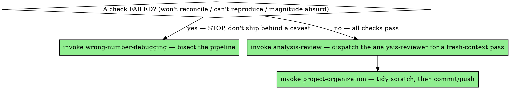

# Result Verification

## Overview

The last mile is where good analyses die. The number is computed, it looks right, the deadline is close — and "looks right" becomes "is right" without anything in between. This skill is the something in between: the checks that stand between a computed number and a claimed result.

This is the analytics counterpart of verification-before-completion. The rule is identical: **evidence before assertions, always.** You do not say "the result is X"; you say "the result is X, here is the reconciliation, here is the clean-room reproduction, here is the robustness."

**Core principle:** A result is not done when it appears; it's done when it has been reconciled, reproduced from scratch, and survived being attacked.

## The verification checklist

Run these before any result leaves your hands. Each maps to a real way final numbers turn out wrong:

1. **Reconcile to source.** Do the parts sum back to the known whole? Does the headline number tie out to a total you can compute a completely different way? A revenue figure should reconcile to the raw ledger; a user count to a distinct count of IDs. Reconciliation by an independent path is the single strongest check that the number is real. (Use float-aware comparison.)

2. **Reproduce from a clean state.** Restart the kernel / session / R process — no cached objects, no leftover variables — set the seed, and run the analysis end to end from raw inputs. A result that only exists because of a variable still in memory from three hours ago is not a result. If it doesn't reproduce, you don't have a finding, you have an artifact.

3. **Confirm determinism.** Same input + same seed → same output, twice. If the number wiggles between runs, there's uncontrolled randomness or ordering dependence, and the figure you're about to report is one sample from a distribution you didn't mean to draw from.

4. **Attack it with robustness.** For confirmatory work, run the suite pre-committed in `pre-analysis-plan` — all of it. Otherwise propose the ~3 perturbations that probe the main threat (dropping outlier percentiles, a clean subsample, the obvious alternative definition) and **get a nod before running any that changes the sample** (`analysis-checkpoints` — which checks to run is the user's call). If the headline swings wildly under a reasonable perturbation, it is fragile and you must say so. **Confirm each variant actually moved something:** a robustness check that returns a number *identical* to the baseline didn't perturb anything — a "leave-one-out" that re-added the row, a subsample filter that matched everything, a flag never read — and is a silent no-op, not evidence of robustness. A check has to *bite* to count.

5. **Read it like an economist** — interpretable units, economic (not just statistical) significance, magnitude plausibility, mechanism, and a benchmark against known estimates. This is the heart of verification for any effect you'll interpret; the full discipline is below.

6. **Tie the artifacts to the prose.** Every number in the text, every figure axis, every table cell — does it match what the code actually produced *in this run*? Stale numbers from an earlier version, a figure that wasn't regenerated, a rounded value that contradicts the table: these are the embarrassing errors that survive everything else because nobody re-checked the copy against the output.

7. **For a structural estimate, verification carries extra load-bearing checks** beyond reconcile-and-reproduce: the Monte-Carlo recovery passed (the estimator recovers known θ from a distant start); the model fits moments it wasn't targeted on and holds up out-of-sample; the counterfactual was computed by *re-solving equilibrium*, not holding endogenous objects fixed; and the implied object (e.g. the own-price elasticity at observed prices) reconciles with the raw descriptive picture. A counterfactual that only exists because prices were held fixed is not verified. See `structural-estimation`.

8. **For a confirmatory result, reconcile against the pre-analysis plan.** Was the reported number the pre-committed primary spec, interpreted against the PAP's decision rule, with secondary tests corrected as pre-registered? **Report a pre-registered null as a finding** — don't bury it (`pre-analysis-plan`).

9. **Get an independent pass, then tidy — before you report.** Dispatch the **`analysis-reviewer`** agent for a fresh-context review of your *own* work (it catches what you rationalized), and tidy the workspace so what ships is deliverables, not scratch (**`project-organization`**). These are steps of verification, not optional extras the user has to ask for.

## Reliability is not validity — verify the number *means* what you think

Reconcile, reproduce, determinism, robustness establish **reliability** — the number is computed correctly from the data. They do not establish **validity** — that the quantity measures the construct you named. A figure can tie out to source, reproduce from a clean session, and survive every robustness re-cut, and still be a precise measure of the *wrong thing*: a count of *visible traces* reported as a count of *the underlying behavior*, a proxy label treated as the truth, a coverage-limited slice named as the whole. Every internal check passes; the number is reliable and wrong. "It's internally consistent" is exactly how a reliable measure of the wrong quantity ships.

Validity is checked against something *outside* the dataset, and at least one such check belongs in verification whenever the number's **level** (not just its precision) carries the claim — for a descriptive count or rate as much as for an estimated effect:

- **A known shock that should move it** — does the series respond, at the right time and sign, to an event that should change it? (The descriptive analog of a placebo.)
- **An external benchmark** — does the level sit in a defensible range next to an independent estimate of the same quantity? An order-of-magnitude gap is a finding to explain with a mechanism, not to report flat.
- **Alternative-construct coverage** — expand the definition along the dimension you suspect is missing and see how far the level moves; a level that is an artifact of *where you looked* is a coverage limit, not a fact.

The deep validity craft for a descriptive count lives in `descriptive-evidence` (plausibility triangulation); for an effect it's the magnitude / mechanism / benchmark pass below. A number that clears every reliability check but no validity check is **submitted, not verified**.

## A check failed — stop, don't ship behind a caveat

If a check here fails and you cannot resolve it — a total won't reconcile, the estimate swings wildly under a reasonable perturbation, the magnitude is absurd — **stop and bring the failure to the user as a decision.** Do not report the result anyway with the problem buried in a caveat; "evidence before assertion" means a failed check blocks the claim, not footnotes it. (Where the fix is a data bug, route to `wrong-number-debugging`; where it's a design/sample/spec change, to `analysis-checkpoints`.)

## Read the estimate like an economist

A coefficient that reconciles and reproduces can still be economically meaningless or absurd. Reproducibility tells you the number is *real*; this tells you whether it's *believable* and whether it *matters*. A senior economist won't accept an estimate until it passes here:

- **Convert to interpretable units.** A raw coefficient is not yet a finding. Turn it into an elasticity, a semi-elasticity, a percent of the mean, a fraction of an SD, a dollar figure — whatever lets a reader feel the size. "0.043" means nothing; "a 4% increase, or about a third of the control-group gap" means something.
- **Economic significance, not just statistical.** The question is never only "is it distinguishable from zero" — it's "is it big enough to matter for the decision or for welfare." A precisely-estimated tiny effect and a precise zero are, economically, the same answer: *no*. Say so, rather than dressing a trivial effect in stars.
- **Back-of-envelope the magnitude.** Does the size survive contact with how the world works? Translate it into an implied behavioral response, an implied total dollar amount, or an implied share of a known aggregate, and check that the implication isn't absurd (an effect larger than the outcome's possible range, a response no one would plausibly make, a dollar figure exceeding the whole market).
- **Mechanism consistency.** Does the sign and size match the channel you posited in `question-framing`? If the mechanism has auxiliary predictions (it should bite harder for some subgroup, show up in an intermediate outcome), check those too — a real effect usually leaves more than one fingerprint.
- **Benchmark against what's known.** How does it compare to existing estimates of the same or similar parameter? Being far off the literature isn't disqualifying, but it demands an explanation you can state. An estimate 10× the consensus is a claim that you've overturned the consensus — be sure that's what you mean.

When the magnitude is implausible, that is a result to investigate (`wrong-number-debugging`) or a finding to defend with a mechanism — never a number to report with a shrug.

## Evidence before assertion

The failure mode is claiming completion you haven't verified — "the analysis is done," "the numbers check out," "it reproduces." Replace every such claim with the output that proves it. Don't write "totals reconcile"; show the reconciliation line where the two independently-computed numbers match. Don't write "it's robust"; show the table of the estimate under each perturbation. An unverified "done" is just hope with a deadline.

## Freeze the verified result

Once it passes, snapshot it as a golden output (see `data-contracts`). The verified number becomes the baseline that the next run is diffed against — so if a refactor or a data refresh silently changes it, you find out loudly instead of three weeks later in a meeting.

## Consult — and capture — what bit you

**Consult first (at the start, and before you report).** An established project keeps its scar tissue in `docs/LESSONS.md` and in your memory — the silent failures that bit it before. **Read them when you pick up the analysis and again before reporting**, and check whether any apply here: a prior fan-out on these tables, a vintage mismatch in this geography, a figure-vs-note estimand trap. Recall is the half of the loop that makes a logged bug actually stop recurring — capture without consult is a write-only journal. (These are *recalled*, not folded wholesale into this skill: the lesson is domain-specific and lives in the project.)

**Capture at the end.** Before you close out, do a 60-second retro: **what silent failure actually bit this project** — the fan-out join, the leaked feature, the bad control, the implausible magnitude you almost shipped? Write it down in `docs/LESSONS.md` (one line: symptom, cause, the check that would have caught it). A lesson recorded is a bug that won't recur silently.

**Folding a lesson into the general skills is the rare exception, not the default.** Most lessons are domain-specific (this dataset, this geography) and belong *only* in the project — reached by the consult step above, never dragged into the shared family. Fold one upward **only** when the *pattern*, stripped of domain, would help a project that's never seen this data (e.g. "versioned join keys need a vintage assertion"); leave the instance in the project, and **skill edits need the user's sign-off** — propose, don't silently rewrite.

**And keep the stores lean.** If, while consulting, you find `LESSONS.md` sprawling or a memory file grown into a document, *suggest* a consolidation/prune pass (the `consolidate-memory` skill for memory) — surface it, don't hoard, don't auto-run.

## Language cheat-sheet

| Need | Python | R | Julia |
|---|---|---|---|
| Clean reproduction | restart kernel; `python script.py` from scratch | `Rscript` in a fresh session; `callr::r()` | fresh `julia script.jl` |
| Fix the seed | `np.random.seed(...)` / `random_state=` | `set.seed(...)` | `Random.seed!(...)` |
| Reconcile (float-aware) | `assert np.isclose(a, b)` | `stopifnot(isTRUE(all.equal(a, b)))` | `@assert isapprox(a, b)` |
| Outlier-sensitivity | refit on `df[df.x.between(q01, q99)]` | refit on winsorized data | refit on filtered frame |

## Red flags — STOP

- About to report a number you computed but never reconciled by a second path.
- "It reproduces" — but you never actually restarted the kernel and re-ran from raw inputs.
- A figure or table number that you haven't confirmed matches the current run's output.
- Reporting a point estimate with no idea whether it survives dropping a few outliers.
- A magnitude you haven't sanity-checked against anything external.
- A level that surprised you (too high or too low) and you've checked against the data but never against an external anchor — a known shock, a benchmark, or a wider definition.
- Writing "the numbers check out" instead of showing the output that checks them out.

## Common rationalizations

| Excuse | Reality |
|---|---|
| "It ran fine, it's done." | Running and being correct are different claims. Only one of them protects the stakeholder. |
| "It reproduces — I just ran it." | Re-running in the same session with cached state isn't reproduction. Restart and run from raw. |
| "Robustness is overkill for an internal number." | The internal number drives the decision. Fragile-but-unchecked is how a bad decision gets made confidently. |
| "analysis-review will catch whatever I miss." | Review assumes verification already passed — an unverified number wastes the reviewer on arithmetic. Verify first, then dispatch review. |
| "I already eyeballed the figures." | Eyeballing doesn't catch a stale number copied from last week's version. Tie each one to this run's output. |
| "Every check passed, the number's solid." | Those checks prove it's computed right (reliability), not that it measures what you named (validity). Anchor the level to something outside the data. |
| "The deadline is now." | A wrong number presented on time is worse than a right one presented late, and far worse than a caveated one on time. |

## When to Use → where this hands off

Verification is **not** the finish line. It either *fails and bisects*, or it *passes and propels* into the independent review and the tidy-up — route imperatively, don't just note the relationship:



## The Process

1. **Run the checklist** — reconcile to source, reproduce clean, confirm determinism, attack with robustness, read it like an economist, tie artifacts to prose, freeze the golden output.
2. **If any check fails and you can't resolve it → STOP and invoke `wrong-number-debugging`** to bisect (or `analysis-checkpoints` if the fix is a design/sample/spec change). Do not footnote a failed check.
3. **All checks pass → invoke `analysis-review`** — dispatch the independent `analysis-reviewer` to catch the silent failures you rationalized, *before* you ship.
4. **Then invoke `project-organization`** — tidy scratch from deliverables before you commit or push. Don't end at "the result is X" — route to the review and the tidy-up.

## The bottom line

```
Reported result  →  reconciled by an independent path, reproduced from a clean state, survived robustness, artifacts tied to prose
Otherwise         →  not verified, just submitted
```
