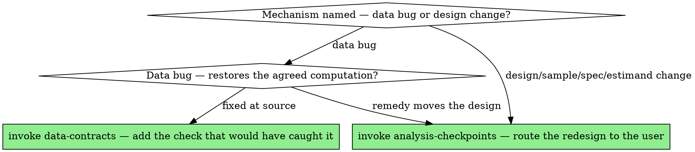

# Wrong-Number Debugging

## Overview

A surprising number is data trying to tell you something. The instinct is to patch it — add a `dropna`, a `distinct`, a filter — until it looks reasonable. That instinct is how a symptom gets hidden and the real bug ships. The discipline here is the same as systematic debugging in software: **find the step where the number went bad before you change anything.**

**Core principle:** Locate the bug by bisecting the pipeline, not by guessing at fixes. The number is wrong *somewhere specific* — find where, then you'll know why.

## Why analytics debugging is its own thing

In software the bug usually announces itself with a stack trace pointing near the cause. In analysis there is no trace — just a number that's too big. The pipeline ran clean. The bug is somewhere in a chain of joins, filters, groupings, and recodes, and the only signal you have is that the *output* is wrong. So you work backward through the chain, checking the number at each stage, until you find the stage where it stopped being right. That stage contains the bug.

## The loop

```
REPRODUCE  →  LOCATE (bisect)  →  EXPLAIN  →  FIX AT THE SOURCE  →  RE-CONTRACT
```

1. **REPRODUCE** — Pin the wrong number down to a deterministic, minimal case. Same input, same seed, same result every time. If it's intermittent, you have hidden state (ordering, randomness, a mutated global) and *that* is the bug. Shrink to the smallest subset of rows that still shows it — debugging on 50 rows beats debugging on 50 million.

2. **LOCATE by bisection** — This is the heart of it. Walk the pipeline and check the number at each intermediate stage:
   - What is the row count / total / value right after **load**? Is it already wrong? Then the bug is upstream — in the source or the extract, not your code.
   - After each **join**? (Joins are the prime suspect — check row counts before and after every one.)
   - After each **filter**? (Did a filter on a column with `NA`/`missing` silently drop rows you wanted? Null-aware filters surprise people in every language.)
   - After each **group-by / aggregate**? (Wrong grain, double-counting, a `sum` over a fanned-out join.)
   - After each **recode / type cast**? (A coercion turned `"1,000"` into `NA`, or strings into a factor with a surprise level.)

   Binary-search it: check the middle of the chain. Wrong already? Bug is in the first half. Still right? Second half. A ten-step pipeline localizes in three or four checks.

3. **EXPLAIN** — Once you've found the stage, explain *why* in one sentence before touching code. "The join fanned out because `customer_id` is not unique in the orders table." If you can't articulate the mechanism, you haven't found the bug yet — keep bisecting.

4. **FIX AT THE SOURCE — but first answer the dividing question:** *am I restoring the analysis we agreed on, or changing it?* Answer it before you touch anything; the two branches are very different:
   - **Data-bug fix** (restores the intended computation): the join fanned out, so dedup the right table or aggregate before joining; the units were wrong, so correct them; the date parse broke, so repair it. This returns the analysis to what was already agreed — **do it, then report what you found and fixed.** (Don't slap a `distinct()` on the final output to paper over tripled rows — fix the key, not the symptom.)
   - **Analytical-design change** (changes what is being estimated): the bug is real, but the remedy would change the design, the spec, the sample, or the estimand. **This is not yours to do — STOP and route it through `analysis-checkpoints`.** Present the threat, the candidate remedies, and your recommendation, and let the user decide. Implementing the redesign and presenting it as "the fix" is exactly the behind-the-back decision to avoid.
   - **The trap:** *winsorizing, dropping outliers, adding a control, or restricting the sample* feels like cleaning but is a **sample/spec change** — it belongs on the design side (STOP), not the data-bug side. And a genuine data-bug fix that nonetheless *moves a number the user has already seen* still gets surfaced before you build on it.

5. **RE-CONTRACT** — Add a `data-contracts` check that would have caught this, and watch it bite on the broken version. A bug you found once should never silently return. (If the user approved a *redesign* in the branch above, the new spec re-enters at REPRODUCE — it's a new result to validate, not a closed bug.)

## Trace provenance backward — the usual culprits

When you hit the bad stage, this is where the bodies are buried. Run down the list:

- **Fan-out join** — a non-unique key on the "one" side multiplied rows. Symptom: totals inflated by a clean-ish factor (2×, 3×). Check: row count before vs. after; key uniqueness.
- **Vanishing rows** — an inner join (or a null-dropping filter) silently discarded unmatched rows. Symptom: totals too low. Check: anti-join to see what failed to match.
- **NA / missing poisoning** — one missing value turned a `sum`/`mean` into `NA`/`NaN`, or `na.rm`/`skipmissing` quietly dropped values and biased the result. Check: count missing before aggregating.
- **Units / scale** — dollars vs. cents, proportion vs. percent, ms vs. s. Symptom: off by a round factor (100×, 1000×). Check: the units in the source vs. what you assumed.
- **Wrong grain** — you aggregated at the wrong unit of observation, double-counting user-sessions as users. Check: is one row really one of what you think?
- **Surprise category level** — a stray `"unknown"`, a trailing-space duplicate, mojibake, or an unexpected factor level created a phantom group. Check: the full set of distinct levels.
- **Temporal** — a timezone shift or date-floor moved events across a day/period boundary; a resample duplicated a period. Check: explicit tz, period boundaries.
- **Upstream surgery** — the data was already sampled, deduplicated, or filtered before it reached you (see the provenance notes from `data-contracts`). Check: the lineage, not just your own code.

## Don't reach for the fix too early

The strongest pull in debugging a wrong number is to fix it before you understand it — because a plausible patch is right there and it makes the number look sane. Resist. A number made to *look* right by an unexplained patch is more dangerous than the obviously-wrong number you started with, because now it's hidden. No fix until you can name the mechanism.

## Debugging is the back door for silent redesigns

The most dangerous moment in debugging is when the investigation surfaces a *design* problem and you "fix" it by changing the design — without telling the user. It feels like debugging; it's actually a unilateral redesign.

> **Example.** Chasing a surprisingly large near-clinic effect, you find the 2016 citywide recording jump is geographically uneven (Beverly's 2 mi ring +66% in 2016 while its 0.5 mi ring is flat). A plain near-vs-far DiD would misread this as an acquisition effect. The *remedy* — upgrade to a triple-difference with band×month fixed effects — is sound. But it changes the pre-registered identification strategy.

Your job here ends at **diagnose and explain**. You surface the threat and the candidate remedies; you do **not** write the triple-difference and present it as "the fix." Changing the design, sample, spec, or estimand is a `analysis-checkpoints` decision — stop and let the user choose.

## Language cheat-sheet

| Need | Python | R | Julia |
|---|---|---|---|
| Row count at a stage | `len(df)` / `df.shape[0]` | `nrow(df)` | `nrow(df)` |
| See unmatched join keys | `merge(..., indicator=True)` then count | `anti_join(a, b)` | `antijoin(a, b, on=:id)` |
| Count missing | `df.isna().sum()` | `colSums(is.na(df))` | `count(ismissing, col)` |
| Distinct levels | `df.col.value_counts(dropna=False)` | `table(df$col, useNA="always")` | `countmap(col)` |
| Key uniqueness | `df.id.is_unique` | `!any(duplicated(df$id))` | `allunique(df.id)` |

## Red flags — STOP

- Adding a `dropna` / `distinct` / `filter` to make a number look right, without knowing why it was wrong.
- "It's probably just duplicates" — without having checked key uniqueness.
- Debugging on the full dataset instead of shrinking to a minimal failing case.
- Fixing the final output when the bug is three joins upstream.
- Declaring it fixed without adding a check that bites on the old broken version.
- **Changing the research design, spec, sample, or estimand to make a number behave — without surfacing it to the user as their decision (`analysis-checkpoints`).**

## Common rationalizations

| Excuse | Reality |
|---|---|
| "A `distinct()` makes it match, good enough." | If you don't know which rows were duplicated and why, you don't know what else that `distinct` is silently dropping. |
| "It's a small discrepancy, probably rounding." | "Small" discrepancies are often a few leaking rows. Find the rows before you blame the floats. |
| "I'll just rebuild the query from scratch." | You'll likely reintroduce the same bug. Localize it first; understand it; then rebuild if you must. |
| "The number looks reasonable now." | "Looks reasonable" is the exact disguise a hidden bug wears. Reasonable ≠ reconciled. |

## When to Use → where this hands off

Debugging is **not** terminal, and it is **not** licence to redesign. Once you've named the mechanism, the dividing question routes you imperatively to exactly one next skill:



## The Process

1. **Reproduce minimally, bisect to the stage, name the mechanism in one sentence.** No fix until you can.
2. **Answer the dividing question** — restoring the agreed analysis, or changing it?
3. **Data bug → fix at the source, then *invoke `data-contracts`*** to add the invariant that would have caught it and watch it bite on the broken version — never patch the symptom on the final output.
4. **Design/sample/spec/estimand change → STOP and *invoke `analysis-checkpoints`*.** Present the threat, the candidate remedies, and your recommendation; do not smuggle a redesign in as a bug fix. An approved redesign re-enters at REPRODUCE as a new result to validate.
## The bottom line

```
Wrong number  →  reproduced minimally, bisected to the stage, mechanism named, fixed at the source, check added
Otherwise     →  a symptom patched and a bug still in the pipeline
```
